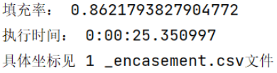

# 高级算法设计与分析课程报告

李志扬 2022202210034

段海岳 2022202210078

## 1 背景

本报告是高级算法设计与分析的火车装箱算法设计报告，具体场景与设计需求如下：

在将货物装入货车的过程中，由于货物的大小不一，摆放方法的不同影响着货车最后的装填效率。因此，为了提高效率，本报告希望设计一种货车装箱算法，并达到较高的装填效率（即85%以上）。程序接收.xlsx文件的批量输入数据，在考虑货箱不同摆放状态的情况下，从多个货箱中选择一部分货箱进行摆放，最后以.scv文件的形式保存每种情况下的具体摆放方式以及相应的填充率。

开发环境：PyCharm Community Edition 2022.2.1

## 2 程序设计思路

程序从.xlsx文件中读取实验用到的所有数据，并最终将每次实验的填充率和实验得到的放置坐标保存在.csv文件中。

### 2.1 Cargo.py

此文件用于描述货物中，包括货物的坐标等，详细内容如下所示：

```
class CargoPose(Enum):
tall_wide = 0
tall_thin = 1
mid_wide = 2
mid_thin = 3
short_wide = 4
short_thin = 5
```

此类用于描述货物的摆放方式，一共有6中摆放方式，为了直观描述，用上述六种。

```
class Point(object):
def \__init__(self, x: int, y: int, z: int) -\> None:
self.x = x
self.y = y
self.z = z

def \__repr__(self) -\> str:
return f"({self.x},{self.y},{self.z})"

def \__eq__(self, \__o: object) -\> bool:
return self.x == \__o.x and self.y == \__o.y and self.z == \__o.z

@property
def is_valid(self) -\> bool:
return self.x \>= 0 and self.y \>= 0 and self.z \>= 0

@property
def tuple(self) -\> tuple:
return (self.x, self.y, self.z)
```

此段代码中，*init*、*repr*、_eq_用于建立三维坐标系，在程序中用x,y,z可进行调用。Is_valid和tuple用于简化后续对三维点的操作并在类中设置合法性属性和序列化属性。

在Cargo.py文件中，剩下的内容均为cargo类中的内容：

```
class Cargo(object):
def \__init__(self, length: int, width: int, height: int) -\> None:
self._point = Point(-1, -1, -1)
self._shape = {length, width, height}
self._pose = CargoPose.tall_thin

def \__repr__(self) -\> str:
return f"{self._point} {self.shape}"
```

以上部分用于货物的初始化，读取货物的尺寸信息进行赋值。

货物的长宽高在不同的摆放方式中其尺寸也有变化，故根绝货物的摆放方式设置长宽高属性，根绝不同的摆放方式返回不同的值，使用字典：（在此处仅展示了长属性，宽高类似）

```
@property
def pose(self) -\> CargoPose:
return self._pose

@pose.setter
def pose(self, new_pose: CargoPose):
self._pose = new_pose

@property
def \_shape_swiche(self) -\> dict:
edges = sorted(self._shape)
return {
CargoPose.tall_thin: (edges[1], edges[0], edges[-1]),
CargoPose.tall_wide: (edges[0], edges[1], edges[-1]),
CargoPose.mid_thin: (edges[-1], edges[0], edges[1]),
CargoPose.mid_wide: (edges[0], edges[-1], edges[-1]),
CargoPose.short_thin: (edges[-1], edges[1], edges[0]),
CargoPose.short_wide: (edges[1], edges[-1], edges[0])
}
@property
def length(self) -\> int:
return self.shape[0]

@property
def shape(self) -\> tuple:
return self._shape_swiche[self._pose]

@shape.setter
def shape(self, length, width, height):
self._shape = {length, width, height}
```

货物的位置信息通过x、y、z三种属性来表示，以直接通过货物实例访问其位置：（在此处只展示了x属性的表示，y、z属性与其类似）

```
@property
def point(self):
return self._point

@point.setter
def point(self, new_point: Point):
self._point = new_point

@property
def x(self) -\> int:
return self._point.x

@x.setter
def x(self, new_x: int):
self._point = Point(new_x, self.y, self.z)
```

通过设置投影信息来进行碰撞检测，设置不同的投影面以进行碰撞检测，在二维平面上考虑三维空间中的实体的投影，通过各个方向上的投影情况判断是否冲突。易得，任意平行于长方体容器放置的长方体货物，如果它们在任意方向上的投影没有重叠，则两者就没有冲突。

```
def get_shadow_of(self, planar: str) -\> tuple:
if planar in ("xy", "yx"):
x0, y0 = self.x, self.y
x1, y1 = self.x + self.length, self.y + self.width
elif planar in ("xz", "zx"):
x0, y0 = self.x, self.z
x1, y1 = self.x + self.length, self.z + self.height
elif planar in ("yz", "zy"):
x0, y0 = self.y, self.z
x1, y1 = self.y + self.width, self.z + self.height
return (x0, y0, x1, y1)
```

### 2.2 Container.py

为了方便考虑，本实现中将货车抽象为一个长方体，假设其长、宽、高分别为L、W、H，靠近驾驶座的一个角设为坐标原点(0, 0, 0)。货车车厢远离驾驶座的一侧是打开的，以便于货物的装载。从直觉来看，货物沿着边缘叠放的效率最高，因此考虑从边缘开始放置。

基于这些考虑，设计了Container类，其成员变量主要包含本身的长、宽、高，同时还需要维护一个当前可放置点的有序列表，和已经放置了的货物的列表。

在货物装入车厢前，需要判断货物是否可以放进货车车厢中，即判断货物是否可以被包含在车厢内部，然后判断该货物是否会和已经放入车厢的货物产生冲突，实现代码如下：

```
encasable = True
temp = deepcopy(cargo)
temp.point = site
if (
temp.x + temp.length \> self.length or
temp.y + temp.width \> self.width or
temp.z + temp.height \> self.height
):
encasable = False
for setted_cargo in self._setted_cargos:
if \_is_cargos_collide(temp, setted_cargo):
encasable = False
```

其中货物是否冲突是依据两个货物三个面的投影是否会产生重叠来判断的。

在放置货物时，需要保存一个标记来判断货物是否成功放入车厢，并记录成功的存放点，代码实现如下：

```
for point in self._available_points:
if (
self.is_encasable(point, cargo) and
point.x + cargo.length \< self._horizontal_planar and
point.z + cargo.height \< self._vertical_planar
):
flag = point
break
```

如果当前找不到可以存放的位置，则需要考虑其他的点，检查在调整参考面之后能否存放该货物，代码实现如下：

```
if (
self._horizontal_planar == 0 or
self._horizontal_planar == self.length
):
if self.is_encasable(Point(0, 0, self._vertical_planar), cargo):
flag = Point(0, 0, self._vertical_planar)
self._vertical_planar += cargo.height
self._horizontal_planar = cargo.length
elif self._vertical_planar \< self.height:
self._vertical_planar = self.height
self._horizontal_planar = self.length
if \__is_planar_changed():
flag.z == 0
```

最后如果能成功存放，则更新当前可以放货物的点：

```
if flag.is_valid:
cargo.point = flag
if flag in self._available_points:
self._available_points.remove(flag)
self._adjust_setting_cargo(cargo)
self._setted_cargos.append(cargo)
self._available_points.extend([
Point(cargo.x + cargo.length, cargo.y, cargo.z),
Point(cargo.x, cargo.y + cargo.width, cargo.z),
Point(cargo.x, cargo.y, cargo.z + cargo.height)
])
self._sort_available_points()
```

在更新当前可放置的位置时，还需要对货物现在的位置进行调整，使货物之间不存在冲突，并提高车厢空间的利用率，实现代码如下：

```
for i in range(3):
is_continue = True
while xyz[i] \> 1 and is_continue:
xyz[i] -= 1
temp.point = Point(xyz[0], xyz[1], xyz[2])
for setted_cargo in self._setted_cargos:
if not \_is_cargos_collide(setted_cargo, temp):
Continue
xyz[i] += 1
is_continue = False
break
```

### 2.3 Init.py

此类用于实现自定义的两个装在策略：装箱顺序和货物摆放方式。

```
class Strategy(object):
\# 继承此类 重写两个静态函数 实现自定义两个装载策略: 装箱顺序 和 货物.
@staticmethod
def encasement_sequence(cargos:Iterable) -\> Iterable:
return cargos

@staticmethod
def choose_cargo_poses(cargo:Cargo, container:Container) -\> list:
return list(CargoPose)
```

此部分代码实现了摆放方式的选择，并顺便完成了空间利用率的计算和输出，每一个货物，将其按六种摆放方式摆放，从第一种开始遍历，若可以装入则不再考虑后续的摆放方式，若不可装入则遍历后续的摆放方式（具体判断是否能够摆放的代码见Container.py），最后返回的内容为此时装入的货物占总体积的占比：

```
def encase_cargos_into_container(
cargos:Iterable,
container:Container,
strategy:type
) -\> float:
sorted_cargos:List[Cargo] = strategy.encasement_sequence(cargos)
i = 0 \# 记录发当前货物
while i \< len(sorted_cargos):
j = 0 \# 记录当前摆放方式
cargo = sorted_cargos[i]
poses = strategy.choose_cargo_poses(cargo, container)
while j \< len(poses):
cargo.pose = poses[j]
is_encased = container._encase(cargo)
if is_encased.is_valid:
break \# 可以装入 不在考虑后续摆放方式
j += 1 \# 不可装入 查看下一个摆放方式
if is_encased.is_valid:
i += 1 \# 成功放入 继续装箱
elif is_encased == Point(-1,-1,0):
continue \# 没放进去但是修改了参考面位置 重装
else :
i += 1 \# 纯纯没放进去 跳过看下一个箱子
return sum(list(map(
lambda cargo:cargo.volume,container._setted_cargos
))) / container.volume
```

基于贪心算法的策略，从大到小地考虑货物体积，并进行遍历测试每个摆放方式，直至成功装入，encasement_sequence()函数用于将箱子按照体积进行排序：

```
class VolumeGreedyStrategy(Strategy):
@staticmethod
def encasement_sequence(cargos:Iterable) -\> Iterable:
return sorted(cargos, key= lambda cargo:cargo.volume,reverse=1)

@staticmethod
def choose_cargo_poses(cargo:Cargo, container:Container) -\> list:
return list(CargoPose)
```

## 3 实验结果

每个实验的测试结果存放在data文件夹中，结果表明均能达到目标填充率，在85%以上。以实验E1-1为例，执行花销为25.35秒，最终得到的填充率为86.22%，即总共放入了81个货物。



其他实验的情况如下表：

| **实验** | **填充率** | **执行时间** |
|----------|------------|--------------|
| E1-2     | 0.8720     | 52.65        |
| E1-3     | 0.8720     | 53.37        |
| E1-4     | 0.8868     | 1:47.06      |
| E1-5     | 0.8868     | 1:58.29      |
| E2-1     | 0.8893     | 56.39        |
| E2-2     | 0.8970     | 1:17.55      |
| E2-3     | 0.8999     | 1:39.55      |
| E2-4     | 0.8970     | 1:40.22      |
| E2-5     | 0.8970     | 1:20.25      |
| E3-1     | 0.8970     | 1:20.47      |
| E3-2     | 0.8970     | 2:01.30      |
| E3-3     | 0.8970     | 1:36.14      |
| E3-4     | 0.8970     | 1:37.45      |
| E3-5     | 0.8970     | 2:36.15      |
| E4-1     | 0.8970     | 1:44.35      |
| E4-2     | 0.8970     | 1:55.20      |
| E4-3     | 0.8970     | 1:52.36      |
| E4-4     | 0.8970     | 2:23.69      |
| E4-5     | 0.8970     | 1:56.97      |
| E5-1     | 0.8970     | 1:30.12      |
| E5-2     | 0.8970     | 1:49.72      |
| E5-3     | 0.8970     | 2:05.90      |
| E5-4     | 0.8970     | 1:56.65      |
| E5-5     | 0.9053     | 1:56.84      |
