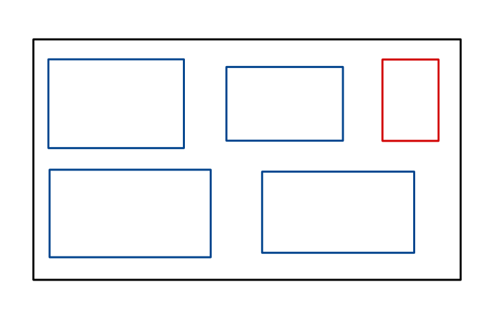
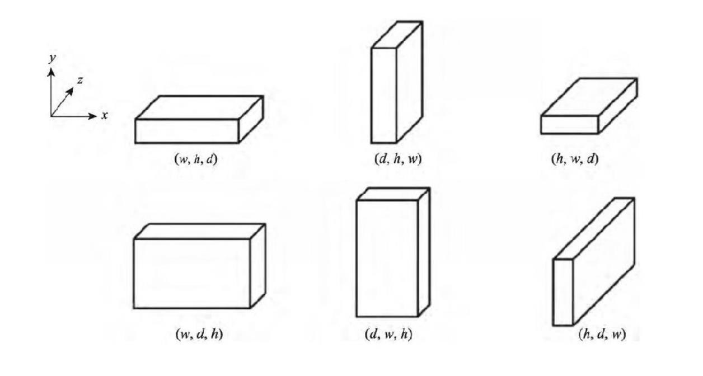
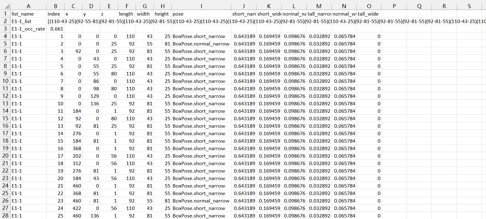

## 问题介绍

物流迅猛发展的如今，物流途中的货物的有效装箱、最大限度地利用好集装箱或者仓库的体积能够为物流运输有效节约成本，但三维装箱问题是一个经典的组合最优化问题和 NP 难问题，具有高度的复杂性。

由于尚无成熟的理论和有效的数值计算方法，对于此类问题目前尚无有效时间内求得精准解的算法，目前对此的主流研究方式主要是启发式算法，在商业运营上也有通过人工智能与运筹优化相融合的技术手段来解决整车装载和舱内布局的装箱算法，本文主要内容是提出了一种类遗传的思路用于优化已有的拟人式三维装箱算法。

## 算法约束与思路

### 算法约束条件（高级部分）

1. 参数考虑小数点后两位；

2. 实现在线算法，箱子按照随机顺序到达，先到达先摆放；

3. 考虑箱子的摆放顺序，依照从内到外，从下向上的摆放顺序；

4. 考虑箱子共有的 3 个不同面，所有每个箱子有 3 种不同的摆放状态；

5. 算法需要实时得出结果，即算法时间小于等于 2 秒。

### 算法输入输出

    **算法输入：** 3DLoad-test-dataSet.docx 文件中提供的集装箱形状参数以及货物形状参数与个数。

    **算法输出：** 各货物摆放顺序、坐标参数以及当前摆放下的集装箱总空间利用效率。

### 算法思路

1. 数据处理
   
   将 3DLoad-test-dataSet.docx 文件中提供的数据首先格式化为 JSON 文件，以方便程序读入及处理，具体格式如下：
   
   ```json
   {
       "dataset": [
           {
               "boxes-types": 3,
               "data": [
                   {
                       "name": "E1-1",
                       "Container": [587,233,220],
                       "Boxes": [[108,76,30,40],[110,43,25,33],[92,81,55,39]]
                   },
                   {
                       "name": "E1-2",
                       "Container": [587,233,220],
                       "Boxes": [[91,54,45,32],[105,77,72,24],[79,78,48,30]]
                   },
                   {
                       "name": "E1-3",
                       "Container": [587,233,220],
                       "Boxes": [[91,54,45,32],[105,77,72,24],[79,78,48,30]]
                   },
                   {
                       "name": "E1-4",
                       "Container": [587,233,220],
                       "Boxes": [[60,40,32,64],[98,75,55,40],[60,59,39,64]]
                   },
                   {
                       "name": "E1-5",
                       "Container": [587,233,220],
                       "Boxes": [[78,37,27,63],[89,70,25,52],[90,84,41,55]]
                   }
               ]
           },
           {
               "boxes-types": 5,
               "data": [
                   ...
               ]
               ...
           },
           ....
       ]
   }
   ```

2. 算法设计
   
   设集装箱体积为$V$，各货物体积为$𝑉_𝑖$，空间利用效率为$\eta = \frac{\sum^n_{i=1} v_i)}{v}$，算法主要目的即为在约束条件下尽量增加空间利用效率$\eta$。 
   
   经分析不难发现，影响空间利用效率的主要因素有以下几点：
   
   **货物装载顺序**
   
   对于大小形状不一的货物，在装载时其先后顺序会导致算法效率有明显差异，例如在有限空间内装载大小不同的货物，如果先装载体积较大货物再装载体积较小货物，可能会出现体积较大货物占用大块空间而导致出现较多空余空间（但大小又不能容纳小货物装载），也可能出现小货物装载完成后仍有较多空间，但又不足以容纳大货物的装载的情况。
   
   **货物装载位置**
   
   货物装载时摆放的位置也会影响货物空间利用效率，如选择大小交错摆放以及按照形状相近物体摆放同一位置的摆放方式会有不同的空间利用效率。
   
   **货物摆放姿势**
   
   由于所给物体均为长方体形状，不同朝向的摆放也会带来摆放不同空间利用率的情况。而在本实验中而言，由于给出的要求为在线算法，箱子按照随机顺序到达，先到达先摆放，因此，货物装载顺序已被限定，选用货物随机到达的方式进行一一摆放，算法中采用随机打乱货物种类的方式进行模拟：
   
   ```python
   # 模拟boxes随机到达
   random.seed(123456)
   online_boxes_list = list(boxes)
   random.shuffle(online_boxes_list)
   print("online_boxes_list=", online_boxes_list)
   ```
   
   ```
   boxes-types: 15
   name: E5-1
   Boxes(L, W, H, N): [[98, 73, 44, 6], [60, 60, 38, 7], [105, 73, 60, 10], [90, 77, 52, 3], [66, 58, 24, 5], [106, 76, 55, 10], [55, 44, 36, 12], [82, 58, 23, 7], [74, 61, 58, 6], [81, 39, 24, 8], [71, 65, 39, 11], [105, 97, 47, 4], [114, 97, 69, 5], [103, 78, 55, 6], [93, 66, 55, 6]]
   online_boxes_list= [(55-78-103), (24-39-81), (39-65-71), (55-66-93), (55-76-106), (36-44-55), (38-60-60), (36-44-55), (24-39-81), (55-78-103), (55-78-103), (24-58-66), (58-61-74), (47-97-105), (55-76-106), (23-58-82), (36-44-55), (24-39-81), (36-44-55), (52-77-90), (60-73-105), (39-65-71), (36-44-55), (55-66-93), (55-76-106), (55-78-103), (36-44-55), (36-44-55), (23-58-82), (58-61-74), (69-97-114), (36-44-55), (58-61-74), (55-66-93), (23-58-82), (36-44-55), (24-39-81), (58-61-74), (55-76-106), (55-78-103), (55-76-106), (38-60-60), (38-60-60), (55-76-106), (39-65-71), (39-65-71), (69-97-114), (39-65-71), (39-65-71), (52-77-90), (39-65-71), (60-73-105), (24-39-81), (47-97-105), (39-65-71), (36-44-55), (23-58-82), (55-76-106), (55-76-106), (52-77-90), (36-44-55), (24-58-66), (23-58-82), (69-97-114), (60-73-105), (60-73-105), (39-65-71), (60-73-105), (55-66-93), (60-73-105), (47-97-105), (55-66-93), (24-58-66), (39-65-71), (58-61-74), (39-65-71), (24-39-81), (58-61-74), (60-73-105), (69-97-114), (38-60-60), (23-58-82), (23-58-82), (60-73-105), (24-39-81), (55-78-103), (24-58-66), (24-39-81), (47-97-105), (55-76-106), (60-73-105), (55-66-93), (55-76-106), (38-60-60), (60-73-105), (69-97-114), (38-60-60), (24-58-66), (38-60-60), (36-44-55)]
   ```
   
   货物的装载位置为二维装箱的拟人启发式算法在三维装箱问题中的扩展,通过在装填过程中引入了**参考箱子**、**参考线**等概念来引导装填过程。[1]
   
   同时依照日常生活经验可知，当箱子按**从内到外，从下向上**的摆放顺序进行摆放时，更容易为后续的箱子留下足够的空间。按照这样的思想进行摆放后，除最初状态外，对于任意时刻的集装箱中，每个已装入的箱子最多只有三个顶点可以作为新箱子的放置原点，将所有这些可放置的点收集起来，在每次放入时遍历进行判断，便可十分容易地对能否装入做出评判。
   
   启发式算法是人们在解决日常生活问题中所采用的依靠过往经验规则来解决类似问题的一种方法，而不是依靠系统的有理论依据的步骤去寻找解决问题的最优方法，由于此种方法具有个人检验性，因此也有效率较低甚至失败的可能。本算法采用的启发式经验就是人们往往在摆放物体时会选用与收纳柜朝向一致的方向统一摆放的思路，而在放置不下之后才会考虑其他摆放姿势，简单示意图如下图1：
   
   
   
   <center>图 1 摆放顺序图。蓝色线条长方形为先摆放货物，方向选择为按照储物柜方向进行选择，在摆放不下时再遍历其他摆放姿势，直至可以摆放下为止</center>
   
   
   
   <center>图 2 货物不同摆放姿势</center>
   
   如图 2 所示，可将三维货物分为六种摆放姿势[2]，将其设定为姿势数组，每次按照权重大小由大到小进行遍历，选择可摆放下的权重最大的摆放姿势进行摆放：
   
   ```python
   # 根据当前container的形状设置初始权重
   pose_weight_occ = list_occ(list_occ([5, 4, 3, 1, 2, 0]))
   # print(pose_weight_occ)
   ```
   
   ```python
   while idx_box < len(online_boxes_list):
       idx_pose = 0
       box = online_boxes_list[idx_box]
       # 依次遍历各个pose，找到能放下的pose
       pose_weight_occ = list_occ(pose_weight_occ)
   ```
   
   而后对此摆放姿势权重进行增加并为了方便更新每次进行均一化处理。为了避免第一次摆放并非最优摆放姿势对后期权重所造成的影响，本算法引入遗传算法的变异思想对算法引入随机性以减少第一次摆放存在的失误可能对算法后续带来的后续影响。
   
   遗传算法是一种建立在自然选择和群体遗传机理基础上的自适应概率性搜索算法，它根据“适者生存，优胜劣汰”等自然规则演化而来，可以用来处理复杂的线性、非线性问题，主要步骤包括：
   
   - 构建适当的编码方式
   
   - 随机产生初始群体
   
   - 计算每个编码适应度
   
   - 通过复制、交叉、变异等算子产生新的群体
   
   本算法主要借鉴了遗传算法的第四步，通过对不同摆放姿势的权重数值引入变异概率来增加摆放不同姿势的可能性，避免初次摆放所带来的不利决定性。具体实现为，将此次摆放姿势以外的姿势设置 20%变异概率，变异可能会增加其 30%权重：
   
   ```python
   # 权重以一定概率进行变异(20%)
   # print("be pose_weight_occ=", pose_weight_occ)
   if random.choice([1, 0, 0, 0, 0]):
       # 随机从除第一大外的权重进行变异
       chose_idx = random.choice(list(range(1, 5)))
       pose_weight_occ[chose_idx] += 0.3
       pose_weight_occ = list_occ(pose_weight_occ)
       # print("pose_weight_occ=", pose_weight_occ)
   ```
   
   而后进行权重再均一化与排序处理：
   
   ```python
   def list_occ(input_list: List[int]):
       list_sum = sum(input_list)
       for i, x in enumerate(input_list):
           input_list[i] = x / list_sum
       return input_list 
   
   new_idx = [x[0] for x in sorted(enumerate(pose_weight_occ), key=lambda x:x[1])]
   ```
   
   如此往复进行直至再也摆放不下停止该循环，最终算法的主要流程如下：
   
   ```python
   if __name__ == "__main__":
       with open("output.csv", 'a', encoding='utf-8') as csv_f:
           csv_f.write(f"list_name,index,x,y,z,length,width,height,pose")
           csv_f.write(f",short_narrow,short_wide,normal_narrow,tall_narrow,normal_wide,tall_wide\n")
       # 从json文件中加载数据集
       with open('./3DLoad-test-dataSet.json', 'r') as data_f:
           dataset = json.load(data_f)
           print(dataset)
   
           # 分别输入数据集中的各组数据进行测试
           # for i_types in [4]:
           #     for i_E in [0]:
           for i_types in range(len(dataset['dataset'])):
               for i_E in range(len(dataset['dataset'][i_types]['data'])):
                   idx_boxes_types = i_types
                   idx_E = i_E
                   print("boxes-types:", dataset['dataset'][idx_boxes_types]['boxes-types'])
                   print("name:", dataset['dataset'][idx_boxes_types]['data'][idx_E]['name'])
                   # print("Container(L, W, H):", dataset['dataset'][idx_boxes_types]['data'][idx_E]['Container'])
                   print("Boxes(L, W, H, N):", dataset['dataset'][idx_boxes_types]['data'][idx_E]['Boxes'])
                   current_boxes_list = dataset['dataset'][idx_boxes_types]['data'][idx_E]['Boxes']
                   boxes = []
                   for i in range(len(current_boxes_list)):
                       if i == 1:
                           boxes = [Box(current_boxes_list[i][0], current_boxes_list[i][1], current_boxes_list[i][2]) for _ in
                                    range(current_boxes_list[i][3])]
                       else:
                           boxes.extend([Box(current_boxes_list[i][0], current_boxes_list[i][1], current_boxes_list[i][2]) for _ in
                                         range(current_boxes_list[i][3])])
                   # 加载货柜大小
                   container_size = dataset['dataset'][idx_boxes_types]['data'][idx_E]['Container']
                   case = Container(container_size[0], container_size[1], container_size[2])
   
                   # 模拟boxes随机到达
                   random.seed(123456)
                   online_boxes_list = list(boxes)
                   random.shuffle(online_boxes_list)
                   print("online_boxes_list=", online_boxes_list)
                   # 调用执行装箱
                   occ_rate = load_boxes(online_boxes_list, case)
                   print(occ_rate)
                   # 将输出的摆法存入csv文件
                   case.save_csv(dataset['dataset'][idx_boxes_types]['data'][idx_E]['name'],
                                 str(online_boxes_list).replace(", ", ""), str(occ_rate))
                   # 画图
                   # mplt.draw(case)
                   print()
   ```

3. 代码结构
   
   ```
   ./
   │  3DLoad-test-dataSet.json       # 格式化后的输入数据
   │  3D_CLP_without_mutation.csv    # 不带变异的最终输出
   │  3D_CLP_without_mutation.png    # 不带变异的示意图
   │  3D_CLP_with_mutation.csv       # 带变异的最终输出
   │  3D_CLP_with_mutation.png       # 带变异的示意图
   │  classes.py                     # 各种抽象类函数
   │  main_without_mutation.py       # 不带变异的主函数
   │  main_with_mutation.py          # 带变异的主函数
   │  mplt.py                        # 绘制示意图所需代码
   │  README.md                      # 描述文件
   │
   └─imgs                            # 描述文件中的图片
          A914bl12y6ivuabw.png
          A914bl12y6ivuaxw.png
          A99ka12y6ivxabw.jpg
   
   
   ```

### 实验结果

算法输出结果为摆放结构图与摆放数据 csv 文件：



csv 数据中的抬头信息为：
*list_name, index, x, y, z, length, width, height, pose, short_narrow, short_wide, normal_n
arrow, tall_narrow, normal_wide, tall_wide*

其中，

    list_name 为当前数据列编号，如“E5-1”；

    index 为 box 编号；

    x,y,z 为 box 的放置坐标；

    length,width,height 为 box 的长，宽，高；

    pose 是 box 放置的 pose 编号；

    short_narrow, short_wide, normal_narrow, tall_narrow, normal_wide,tall_wide 分别为每个 pose 当前的权重。
