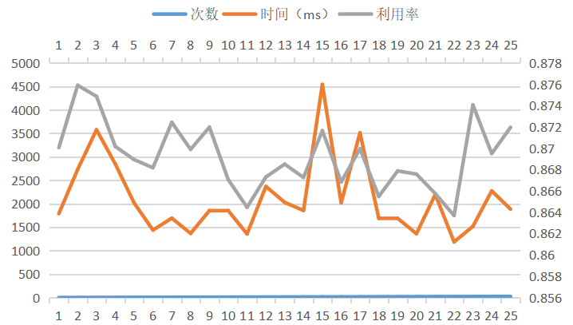
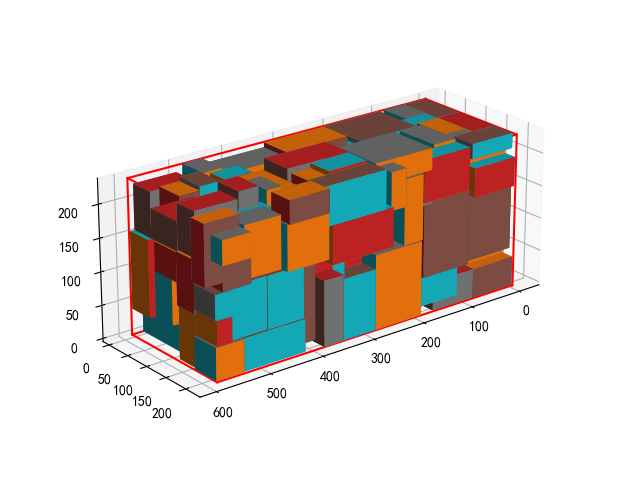

# bpp

## 问题描述

物流公司在流通过程中，需要将打包完毕的箱子装入到一个货车的车厢中，为了提高物流效率，需要将车厢尽量填满，显然，车厢如果能被100%填满是最优的，但通常认为，车厢能够填满85%，可认为装箱是比较优化的。

设车厢为长方体，其长宽高分别为L，W，H；共有n个箱子，箱子也为长方体，第i个箱子的长宽高为li，wi，hi（n个箱子的体积总和是要远远大于车厢的体积），做以下假设和要求：

1. 长方体的车厢共有8个角，并设靠近驾驶室并位于下端的一个角的坐标为（0,0,0），车厢共6个面，其中长的4个面，以及靠近驾驶室的面是封闭的，只有一个面是开着的，用于工人搬运箱子；

2. 需要计算出每个箱子在车厢中的坐标，即每个箱子摆放后，其和车厢坐标为（0,0,0）的角相对应的角在车厢中的坐标，并计算车厢的填充率。


基础部分：

1. 所有的参数为整数；

2. 静态装箱，即从n个箱子中选取m个箱子，并实现m个箱子在车厢中的摆放（无需考虑装箱的顺序，即不需要考虑箱子从内向外，从下向上这种在车厢中的装箱顺序）；

3. 所有的箱子全部平放，即箱子的最大面朝下摆放；

4. 算法时间不做严格要求，只要1天内得出结果都可。

高级部分：

1. 参数考虑小数点后两位；

2. 实现在线算法，也就是箱子是按照随机顺序到达，先到达先摆放；

3. 需要考虑箱子的摆放顺序，即箱子是从内到外，从下向上的摆放顺序；

4. 因箱子共有3个不同的面，所有每个箱子有3种不同的摆放状态；

5. 算法需要实时得出结果，即算法时间小于等于2秒。

本方法在实现基础部分全部要求的基础上，实现了高级部分要求中的1、4，并且在箱子数不是特别多的情况下可以在2s内得出结果。

## 实验环境

硬件：

系统：Windows11

处理器：AMD Ryzen 7 6800H 

内存：16GB

软件：

VSCode+rust-analyzer

Rust

Python3.11+matplotlib

## 运行方法

使用release方式编译以实现更快的运行速度

```bash
cargo run --release
```

在没有rust环境的情况下，这里给出编译生成的文件`bpp.exe`，其中定义了容器的大小为`(587.0, 233.0, 220.0)`，运行要求在当前目录下找到`testdata/data.csv`,最终的运行结果生成在`test.txt`中，其中第一行表示容器大小，后面的每一行表示`(x,y,z,l,w,d)`

## 实验内容

### 问题描述

给定一个长方体车厢和若干个长方体箱子，设计填装方案，使得车厢的填充率尽可能高。

### 假设和约束

1. 箱子完全包含在车厢内部；

2. 箱子与车厢平行放置，箱子的每条边与车厢的相应边保持平行；

3. 箱子不能悬空，必须有物体支撑箱子的底部；

4. 箱子的每个面都可以横放或竖放，一共有6种摆放方式；

5. 箱子的总体积远远大于车厢的体积；

6. 车厢6个面中，4个长面和靠近驾驶室的面封闭，1个面打开用于搬运箱子。

### 算法设计

#### 遗传算法

使用遗传算法来解决装箱问题。遗传算法是一种常用于解决优化问题的算法。它的工作原理是模拟自然进化的过程，包括基因杂交、变异和选择等步骤。在遗传算法中，首先初始化一个种群，其中包含若干个个体。每个个体都有一个基因序列，表示其特征。然后开始迭代，每次迭代中会进行以下步骤：

- 计算每个个体的适应度，及其能解决问题的能力；

- 选择优秀的个体进行基因杂交，产生新的个体；

- 对新的个体进行变异，模拟遗传过程中的基因突变；

- 将新的个体加入种群中，并剔除适应度较差的个体；

- 经过若干次迭代后，可以找到解决问题的最优解。

具体实现如下，首先，定义遗传算法的主循环。在主循环中，不断对种群进行进化。同时定义计数器，用于记录连续多少次迭代后没有发生改进。如果改进发生，将计数器置0；否则，计数器加1。设定某一上限，如果连续没有改进的代数超过了这一上限，则终止循环，认为找到了解决问题的最优解。

在主循环中，首先计算当前种群中每个个体的适应度。适应度是一个度量个体能解决问题的能力的指标。在这里，适应度被定义为车厢的空间利用率，也就是被装进去的箱子占车厢的体积的比例。

接着对种群进行进化。首先选择一些优秀的个体也就是精英，这部分个体不参与进化。然后，产生一些随机基因，并将这些基因转码成个体。同时使用随机数生成器来从精英和非精英中选择两个个体进行交叉，产生新的后代。最后，将所有的精英、变异体和后代合并在一起，并按照适应度从小到大排序。将排序后的种群保存到新的种群中，进入下一次迭代。

其中，每一个个体被定义为包含基因、解决方案和适应度的一个结构体，其中基因决定了箱子序列，解决方案即装箱方案，适应度为车厢利用率。

每一次对个体适应度的计算，就是在完成一次装箱，在整个遗传算法过程中，多次进行了装箱，因此，对装箱算法在效率和利用率上也有很高的要求。

#### 装箱策略

给定一组物品和一个装箱容器的规格，所实现的策略希望将尽可能多的物品装入容器中，使得容器利用率最大。

在装箱过程中，根据经验，将物品按照体积从大到小的顺序装入容器。这样做的原因是，如果先装入体积较小的物品，那么体积较大的物品就可能无法装入容器。而如果先装入体积较大的物品，则更有可能在剩余的空间中找到合适的位置装入体积较小的物品。

虽然只有一个车厢需要装填，但是在本算法中，使用了多个容器来模拟车厢。这么做的原因是，从一开始装入车厢的物品未必能使车厢的利用率最高，虽然使用一个容器的效率会更高，但是为了实现更高的利用率，本算法对所解决的问题进行了一些转化。

在本算法中，尝试实现的策略是，将所有箱子尽可能装入最少的容器中，使得空间利用率最高的容器，其空间利用率最大化。

在装箱算法中，对于每一个箱子，首先根据first fit的原则，找到第一个能够装下该箱子的容器，如果没有，则新建一个规格相同的容器。

判断容器能否装下箱子的方法为，遍历容器中所有的空闲矩阵空间，将箱子进行旋转，依然根据first fit原则，找到第一个能够放入该空间的方向，并在所有的空闲空间中，保留最优的一个，判断最优的原则为，与容器右上角的距离最远，则认为最优。

旋转箱子的目的是找到更适合空闲空间的箱子形态。旋转的方法是对箱子的长宽高进行重新排列组合。

找到放入箱子最合适的位置后，更新容器的空闲空间列表，完成一次装箱。

## 实验结果

这里给出使用E5-5进行测试的样例，为了测试算法的浮点数支持，部分数据后添加了随机的小数，其中的几列分别为宽度、高度、长度和箱子的数量。

| width | depth| height | count |
| --- | --- | --- | --- |
| 113 | 92 | 33 | 8 |
| 52| 37| 28| 12| 
| 57| 33| 29| 5| 
| 99| 37| 30| 12| 
| 92| 64| 33| 9| 
| 119| 59| 39| 12| 
| 54| 52| 49| 8| 
| 75| 45| 35| 6| 
| 79| 68| 44| 12| 
| 116| 49| 47| 9| 
| 83| 44| 23| 11| 
| 98| 96| 56| 10| 
| 78| 72| 57| 8| 
| 98| 88| 47| 9| 
| 41| 33| 31| 13 | 

对上面的数据运行25次装箱算法，结果如下图所示，每次平均运行时长2.105s，平均利用率86.92%。



`drawer.py`用于对装箱结果进行可视化，修改自网络，性能占用较高，渲染效果图仅供参考。

