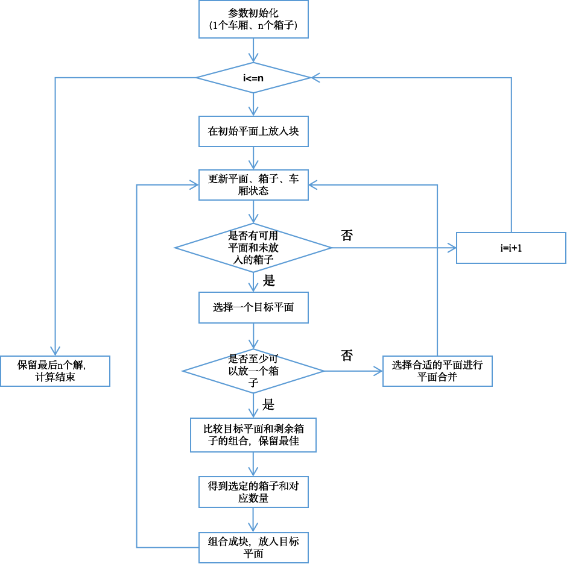
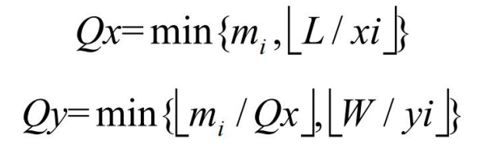
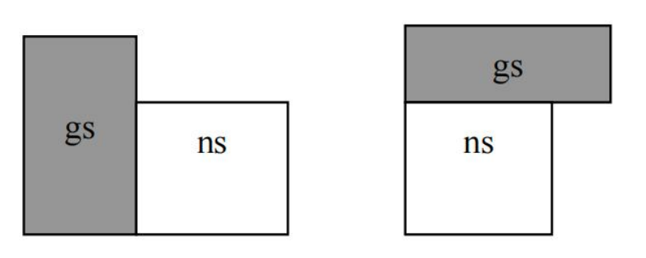
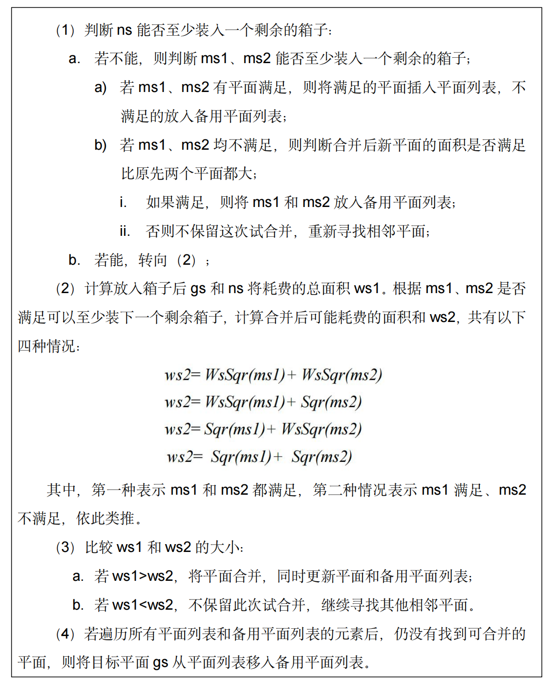
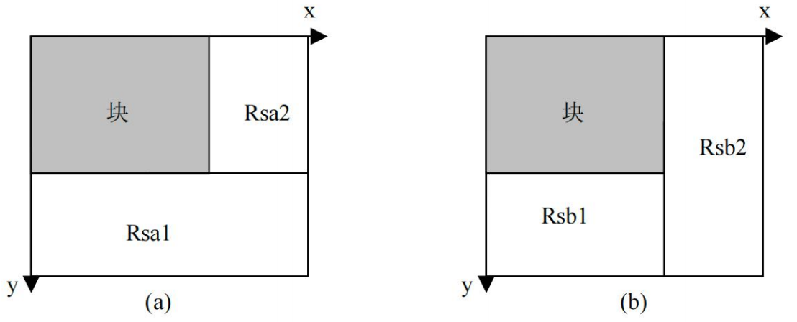
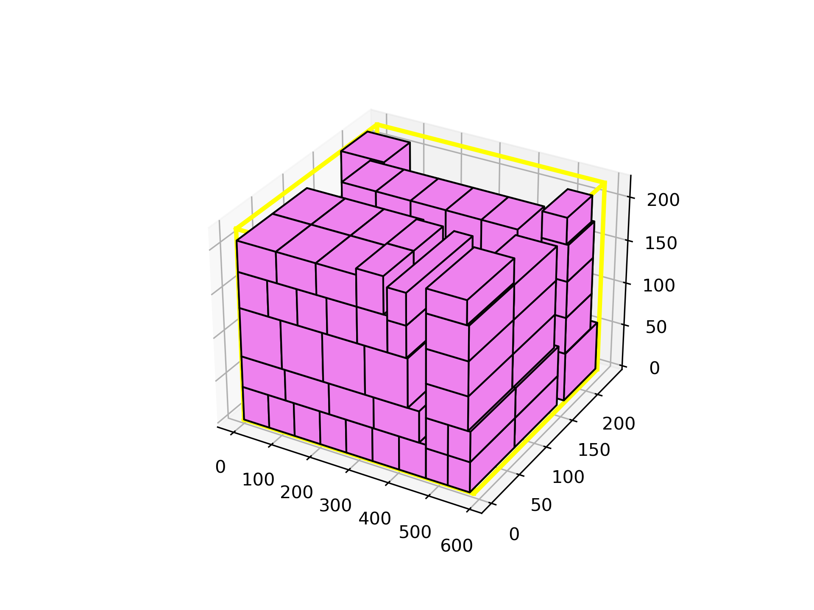

# 3d-bin-container-packing
> 2022202210060 沈茹冰

## Run：
```
$ python main.py
```

## Method：
### 1. Conditions

该算法需要考虑的约束主要包括以下几个方面： 
  * 空间约束，即放入的箱子的边界不能超过车厢长宽高限制的范围。 
  * 稳定性约束，即没有悬空的箱子，上层货物需被下层货物完全支撑。 
  * 方向约束，即箱子可以以 6 个面中的哪几个面作为底面。 
  * 重量约束，即装入的箱子的总重量不能超过车厢限重，但在本次实验中不考虑限重问题。
  
### 2. Algorithm
* 采用基于“块”和“平面”的启发式算法对三维装箱问题进行求解，并采用贪心的策略来生成箱子摆放模式。通过自底向上的方式进行装箱，先铺满车厢底面，再向上堆放物品。
* 算法的大致过程为：首先由完全相同的箱子组成“块”，然后用块自底向上依次填充车厢内的目标平面，并生成新的“平面”，不断重复上述过程。
* 其中，“块”指由相同类型的箱子按照相同摆放方向摆放所组成的单层结构，如果箱子不是同一类型或者摆放位置不同，都是指不同的块。“平面”指可用于摆放箱子的水平面，初始平面即车厢的整个底面，放入第一批箱子后，平面包括这批箱子顶面形成的面和车厢底面空余的部分。

<div align=center>

</div>

#### 2.1 选择平面
因为在本问题情景中，只有一个车厢，所以初始只有一个备选平面，即车厢底面。后续在堆放过程中，会不断产生新的平面，所以需要制定规则来决定选取哪个平面堆放箱子。在该算法中，平面的选择标准如下： 
 1. 优先选择离车厢底面更近的水平面，即选取 z 坐标最小的平面（避免堆积过高，影响货物堆放的稳定性）；
 2. 如果几个平面的空间位置 z 相同，优先选择面积较小的平面（面积小的 平面在后续可能更难利用）；
 3. 若1、2都相同，则比较参考点都 x 坐标，选取 x 坐标最小的平面。若 x 坐标也相同，则比较 y 坐标，选取 y 坐标最小的平面。

#### 2.2 生成块
当确定了目标平面、本次放入的箱子类型后，根据平面的大小和箱子的剩余数量计算该“块”中箱子的数量。设目标平面 X、Y 轴的长度分别为 L、W，待放入的箱子类型 i 的尺寸是 xi、yi、zi，此货物剩余 mi 个。优先在 x 方向上摆放， 则 x、y 方向上的数量分别为：

<div align=center>

</div>

#### 2.3 块和平面组合规则
* 为了最大限度利用目标平面，块和平面的组合规则主要从“剩余面积”和“体积”考虑。
* 首先考虑放入块之后目标平面剩余面积最小的组合，如果剩余面积相同，则比较块的体积大小，选择最大体积的块。
* 在每次向目标平面堆放“块”的过程中，采取贪心思想，每一步的填充过程中，都检测所有剩余的“块”和目标平面的组合效果，并将平面和块的最佳组合作为下次填充的对象。每一步只保留最佳的结果，这样的策略可以大大缩短计算时间，同时由于采用了贪心的思想，所得解的质量在可接受范围之内，即使无法取得全局最优解，但算法的时间复杂度较低，且获得的解是相对优的。

#### 2.4 合并平面
如果选择的平面不能容纳任何一个块，这时需要通过合并平面来增加空间的利用率。一个平面只能和相邻的平面进行合并，两者需要具有相同高度，至少有一边平齐。如下图所示，gs 表示目标平面，ns 表示相邻平面。首先 gs 在平面列表和备用平面列表中依次查找是否存在相邻平面 ns。其中，平面列表指还未使用的新平面列表，备用平面列表指已经计算过不能放入任何块的平面列表。


<div align=center>

</div>

平面合并的过程将其拆分为两个子过程：试合并和正式合并。当目标平面找 到相邻平面时，通过试合并决定是否保留。 设试合并后新产生的两块平面分别为 ms1 和 ms2，判断是否保留该次试合 并及正式合并的算法流程如下：

<div align=center>

</div>

#### 2.5 新平面产生与划分
在每次放入“块”之后，原目标平面被分成三个子平面，如下图左右两种情况所示。所以这里需要确定如何对剩余平面进行划分以产生新平面。这里使用最大面积的方式来划分子平面，即对于两种划分方法，选择产生最大面积子平面的生成方法。

<div align=center>

</div>

启发式算法的总函数的定义在```heuristic()```，首先是由同样大小的箱子生成块。初始时，在剩余空间堆栈中只有车厢本身。然后循环遍历平面列表，选择平面，并查找可用块。如果存在可用块，则用近似最优块填充平面，并更新车厢的最大使用高度；如果不存在可用块，则合并相邻平面。这一过程循环直到平面使用完毕。

## Test Results：
### 1. Visualization
* 所有test的可视化结果见```results```目录，以及装箱坐标见```results/output.txt```。
* 下面是一个test的装箱结果可视化：

<div align=center>

</div>


### 2. Test Results(used_ratio & used_time)
  | test_id | used_ratio | used_time |        
  | :------: | :------: | :------: |
  | E1-1 | 80.413 | 0.19s |                   
  | E1-2 | 79.169 | 0.07s |
  | E1-3 | 79.169 | 0.07s |
  | E1-4 | 83.286 | 0.10s |
  | E1-5 | 71.311 | 0.16s |
  | E2-1 | 70.813 | 0.10s |
  | E2-2 | 82.658 | 0.16s |
  | E2-3 | 67.3   | 0.10s |
  | E2-4 | 74.134 | 0.12s |
  | E2-5 | 80.352 | 0.11s |
  | E3-1 | 69.42  | 0.15s |
  | E3-2 | 78.216 | 0.21s |
  | E3-3 | 73.445 | 0.19s |
  | E3-4 | 73.788 | 0.34s |
  | E3-5 | 66.152 | 0.35s |
  | E4-1 | 66.606 | 0.37s |
  | E4-2 | 71.513 | 0.28s |
  | E4-3 | 68.896 | 0.30s |
  | E4-4 | 82.502 | 0.55s |
  | E4-5 | 68.333 | 0.31s |
  | E5-1 | 74.231 | 0.37s |
  | E5-2 | 79.034 | 0.50s |
  | E5-3 | 74.048 | 0.64s |
  | E5-4 | 73.123 | 0.61s |
  | E5-5 | 75.424 | 0.63s |
