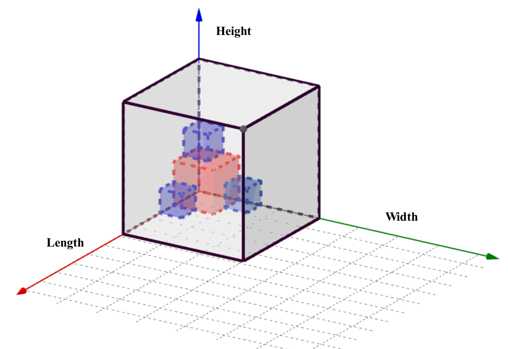
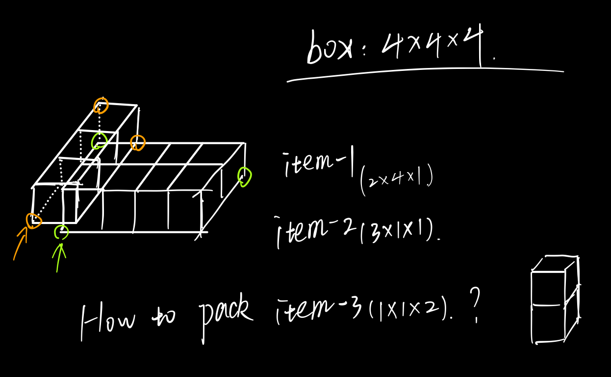
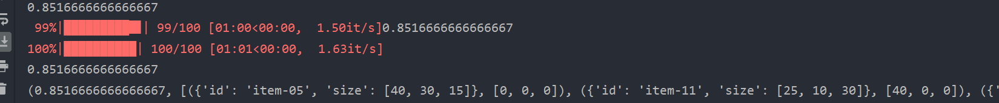
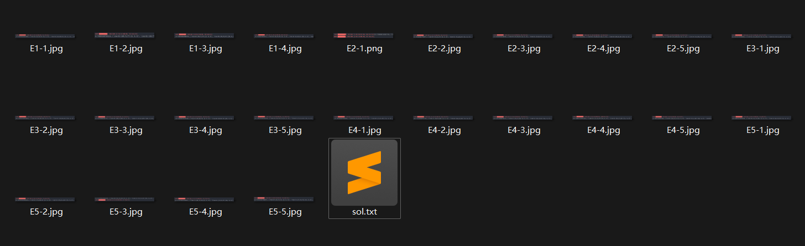
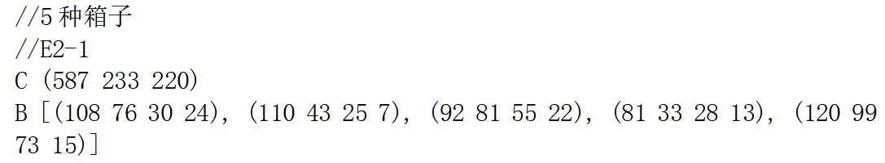
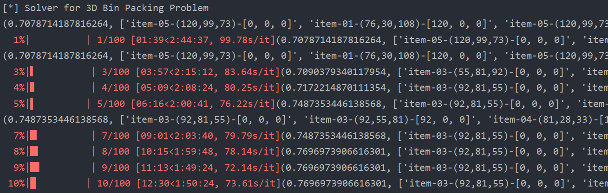
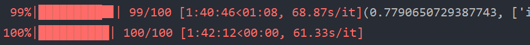

## 高级算法实践-三维集装箱问题

<p align='right'>武汉大学国家网络安全学院</p>
### 问题描述

物流公司在流通过程中，需要将打包完毕的箱子装入到一个货车的车厢中，为了提高物流效率，需要将车厢尽量填满，显然，车厢如果能被100%填满是最优的，但通常认为，车厢能够填满85%，可认为装箱是比较优化的。

设车厢为长方形，其长宽高分别为L，W，H；共有n个箱子，箱子也为长方形，第i个箱子的长宽高为$l_i$，$w_i$，$h_i$（n个箱子的体积总和是要远远大于车厢的体积），做以下假设和要求：

1. 长方形的车厢共有8个角，并设靠近驾驶室并位于下端的一个角的坐标为（0,0,0），车厢共6个面，其中长的4个面，以及靠近驾驶室的面是封闭的，只有一个面是开着的，用于工人搬运箱子；

2. 需要计算出每个箱子在车厢中的坐标，即每个箱子摆放后，其和车厢坐标为（0,0,0）的角相对应的角在车厢中的坐标，并计算车厢的填充率；
3. 因箱子共有3个不同的面，所有每个箱子有6种不同的摆放状态。

### 问题分析

#### 装箱策略

假设固定n个箱子的到达顺序及每个箱子的摆放状态（共有$n!6^n$种可能），则尽可能提升空间利用率的装箱方式如下：“从后到前→从左到右→从下到上”。大小为$(l_i,w_i,h_i)$的箱子以放置点$(x,y,z)$装入车厢后，将增加三个新的放置点$(x+l_i,y,z)$，$(x,y+w_i,z)$，$(x,y,z+h_i)$，如下图所示。



初始的放置点即为$(0,0,0)$，且为保证“从后到前→从左到右→从下到上”的装箱策略，z值越小的放置点优先级越高（z值相同则判断y，y相同再判断x）。

一般来说，放置新箱子时的可行性分析需要考率以下两点：

1. 不超出车厢的边界
2. 与已装入的箱子无空间重合

根据上述约束得到优先级最高的可行放置点即可，但本方案考虑重力影响，举例如下：



item-3最高优先级的可行放置点为$(3,0,1)$，这将导致item-3正下方存在一格未使用空间，即出现“悬浮”情况。因此在实现中，我们使新箱子尽可能地下落。

#### 优化策略

前文分析的是固定装箱顺序及摆放状态的装箱策略，接下来我们使用遗传算法进行优化，即找到空间利用率更高的装箱顺序及摆放状态。染色体编码为长度=n的二元组数组$\{(seq\_id_i,seq\_dir_i)\}_{i=0,1,...,n-1}$，其中seq_id表示箱子的编号，seq_dir（取值为0~5）表示箱子的摆放状态。

crossover（交叉）环节选用单点交叉的PMX算法，类似遗传算法求解旅行商问题在该环节的处理，如下图所示。


mutation（变异）环节存在两种算法，一为随机改变某一箱子的摆放状态，二为随机交换两箱子的装载顺序（各自摆放状态不变），设计为等概率出现（前提为发生变异时）。

selection（选择）环节使用锦标赛算法（即有放回抽样），每次抽取容量为2，fitness（空间利用率）更高者胜出，进入新种群。每轮迭代后选出m个个体，形成下一轮的新种群（m为初始随机生成的种群规模，始终保持规模不变）。

具体实现上，交叉概率$p_c$选为0.7，变异概率选为$0.05$，种群规模选为20，最大迭代次数选为100（可调整）。

### 代码实现

```python
import numpy as np
import random
import copy
from tqdm import tqdm

def init_bins(x, y, z):
    return np.zeros((x, y, z), dtype=np.int)

def pack_item_one(bins, pos, l, w, h):
    x, y, z = pos[0], pos[1], pos[2]
    bins[x:x + l, y:y + w, z:z + h] = 1
    # return bins

# consider gravity (return down_distance)
def is_valid_pack(bins, pos, l, w, h):
    max_x, max_y, max_z = bins.shape
    x, y, z = pos[0], pos[1], pos[2]

    if x + l > max_x or y + w > max_y or z + 1 > max_z:
        return False, 0
    for i in range(x, x + l):
        for j in range(y, y + w):
            if bins[i, j, z]:
                return False, 0

    lower_z = z
    for k in range(z - 1, -1, -1):
        down = True
        for i in range(x, x + l):
            for j in range(y, y + w):
                if bins[i, j, k]:
                    down = False
                    break
            if not down:
                break
        if not down:
            break
        lower_z -= 1

    if lower_z + h > max_z:
        return False, z - lower_z

    for k in range(1, h - z + lower_z):
        for i in range(x, x + l):
            for j in range(y, y + w):
                if bins[i, j, z + k]:
                    return False, z - lower_z

    return True, z - lower_z

def pack_item(items, x, y, z, seq):
    bins = init_bins(x, y, z)  # bin_space_init
    pos_list = [[0, 0, 0]]
    res = []

    dir_trans = [(0, 1, 2), (0, 2, 1), (1, 0, 2), (1, 2, 0), (2, 0, 1), (2, 1, 0)]

    used_bins, total_bins = 0, x * y * z
    for i in range(len(items)):
        pos_list.sort(key=lambda p: (p[2], p[1], p[0]))
        item = items[seq[i][0]]
        seq_dir = seq[i][1]
        l, w, h = item['size'][dir_trans[seq_dir][0]], item['size'][dir_trans[seq_dir][1]], item['size'][dir_trans[seq_dir][2]]
        if l > x or w > y or h > z or (used_bins + l * w * h) > total_bins:
            continue
        for index, pos in enumerate(pos_list):
            isValid, down_dis = is_valid_pack(bins, pos, l, w, h)
            if isValid:
                new_pos = [pos[0], pos[1], pos[2] - down_dis]
                pack_item_one(bins, new_pos, l, w, h)
                res.append("{}-({},{},{})-{}".format(item['id'], l, w, h, new_pos))
                pos_list.pop(index)

                pos_list.append([new_pos[0] + l, new_pos[1], new_pos[2]])
                pos_list.append([new_pos[0], new_pos[1] + w, new_pos[2]])
                pos_list.append([new_pos[0], new_pos[1], new_pos[2] + h])

                used_bins += l * w * h
                break

    # score = bins.sum() / (x * y * z)
    score = used_bins / total_bins
    return score, res

def mutation_seq(seq):  # mutation of packing sequence
    item_num = len(seq)
    if item_num > 1:
        s1, s2 = random.randint(0, item_num - 1), random.randint(0, item_num - 1)
        while s1 == s2:
            s2 = random.randint(0, item_num - 1)
        seq[s1], seq[s2] = seq[s2], seq[s1]
    # return seq

def mutation_dir(seq):  # mutation of one item's direction
    item_num = len(seq)
    s = item_num + random.randint(0, item_num - 1)
    new_dir = random.randint(0, 5)
    while new_dir == seq[s][1]:
        new_dir = random.randint(0, 5)
    seq[s] = (seq[s][0], new_dir)
    # return seq

def crossover(seq1, seq2):
    item_num = len(seq1)
    seq3 = copy.deepcopy(seq1)
    c_pos = random.randint(1, item_num - 1)

    frag1, frag2 = seq1[c_pos:], seq2[c_pos:]
    frag1_id, frag2_id = [i[0] for i in frag1], [j[0] for j in frag2]

    seq3[c_pos:] = seq2[c_pos:]
    for i in range(c_pos):
        seq3_item_id = seq3[i][0]
        if seq3_item_id in frag2_id:
            while seq3_item_id in frag2_id:
                seq3_item_id = frag1_id[frag2_id.index(seq3_item_id)]
            seq3[i] = frag1[frag1_id.index(seq3_item_id)]
    return seq3

def init_ethnic(items, ethnic_num):
    item_num = len(items)
    ethnic_list = []
    seq_id = list(range(item_num))
    for i in range(ethnic_num):
        random.shuffle(seq_id)
        seq_dir = [random.randint(0, 5) for j in range(item_num)]
        ethnic_list.append([(seq_id[j], seq_dir[j]) for j in range(item_num)])
    return ethnic_list

# def gen_new_items(items, seq):
#     new_items = []
#     dir_trans = [(0, 1, 2), (0, 2, 1), (1, 0, 2), (1, 2, 0), (2, 0, 1), (2, 1, 0)]
#     for (seq_id, seq_dir) in seq:
#         new_items.append(copy.deepcopy(items[seq_id]))
#         new_items[-1]['size'] = [new_items[-1]['size'][dir_trans[seq_dir][i]] for i in range(3)]
#     return new_items

def ethnic_iteration(items, x, y, z, ethnic_num, p_cross, p_mut, max_iteration): # p_mut: probability of mutation
    item_num = len(items)
    ethnic_list = init_ethnic(items, ethnic_num)
    score_list, res_list = [], []
    for i in range(ethnic_num):
        # new_items = gen_new_items(items, ethnic_list[i])
        # score, res = pack_item(new_items, x, y, z)
        score, res = pack_item(items, x, y, z, ethnic_list[i])
        score_list.append(score)
        res_list.append(res)
    score_best = max(score_list)
    res_best = res_list[score_list.index(score_best)]

    print((score_best, res_best))

    for i in tqdm(range(max_iteration)):
        for j in range(ethnic_num):
            if random.random() <= p_cross:
                new_seq = crossover(ethnic_list[j], ethnic_list[(j + 1) % ethnic_num])
                if random.random() <= p_mut:
                    if random.random() > 0.5:
                        mutation_seq(new_seq)
                    else:
                        mutation_seq(new_seq)
                ethnic_list.append(new_seq)
                # new_items = gen_new_items(items, new_seq)
                # score, res = pack_item(new_items, x, y, z)
                score, res = pack_item(items, x, y, z, new_seq)
                score_list.append(score)
                res_list.append(res)

        score_best_cur = max(score_list)
        if score_best_cur > score_best:
            score_best = score_best_cur
            res_best = res_list[score_list.index(score_best)]
        print((score_best, res_best))

        select_id = []
        for j in range(ethnic_num):
            select_one_round = np.random.choice(list(range(len(score_list))), 2, replace=False)
            if score_list[select_one_round[0]] >= score_list[select_one_round[1]]:
                select_id.append(select_one_round[0])
            else:
                select_id.append(select_one_round[1])
        score_list = [score_list[k] for k in select_id]
        res_list = [res_list[k] for k in select_id]
        ethnic_list = [ethnic_list[k] for k in select_id]

        # print(ethnic_list)
    return score_best, res_best

if __name__ == '__main__':
    print('[*] Solver for 3D Bin Packing Problem')

    x, y, z = 587, 233, 220
    items_set = [
        {"id": "item-01", "size": [108, 76, 30]},
        {"id": "item-02", "size": [110, 43, 25]},
        {"id": "item-03", "size": [92, 81, 55]},
        {"id": "item-04", "size": [81, 33, 28]},
        {"id": "item-05", "size": [120, 99, 73]}
    ]
    items_num = [24, 7, 22, 13, 15]
    items = []
    for i in range(len(items_set)):
        for j in range(items_num[i]):
            items.append(copy.deepcopy(items_set[i]))

    print(ethnic_iteration(items, x, y, z, 20, 0.7, 0.05, 100))
```

### 实验结果

上述参数下，对自测数据集：

```python
x, y, z = 100, 50, 60
items = [
    {"id": "item-01", "size": [30, 20, 25]},
    {"id": "item-02", "size": [30, 20, 25]},
    {"id": "item-03", "size": [30, 20, 25]},
    {"id": "item-04", "size": [30, 20, 25]},
    {"id": "item-05", "size": [40, 30, 15]},
    {"id": "item-06", "size": [40, 30, 15]},
    {"id": "item-07", "size": [40, 30, 15]},
    {"id": "item-08", "size": [60, 30, 20]},
    {"id": "item-09", "size": [60, 30, 20]},
    {"id": "item-10", "size": [60, 30, 20]},
    {"id": "item-11", "size": [10, 25, 30]},
    {"id": "item-12", "size": [10, 25, 30]},
    {"id": "item-13", "size": [10, 25, 30]},
    {"id": "item-14", "size": [10, 25, 30]},
    {"id": "item-15", "size": [10, 25, 30]},
    {"id": "item-16", "size": [50, 40, 40]},
    {"id": "item-17", "size": [50, 40, 40]},
    {"id": "item-18", "size": [50, 40, 40]},
]
```

得到结果的空间利用率平均都可达到85%以上，且执行效率良好，如下图所示：



几组空间利用率在90%以上的执行结果：

```python
(0.9216666666666666,
     [({'id': 'item-18', 'size': [40, 50, 40]}, [0, 0, 0]), ({'id': 'item-05', 'size': [40, 30, 15]}, [40, 0, 0]),
      ({'id': 'item-10', 'size': [60, 20, 30]}, [40, 30, 0]), ({'id': 'item-09', 'size': [20, 30, 60]}, [80, 0, 0]),
      ({'id': 'item-11', 'size': [30, 10, 25]}, [40, 0, 15]), ({'id': 'item-03', 'size': [30, 20, 25]}, [40, 10, 15]),
      ({'id': 'item-07', 'size': [30, 40, 15]}, [0, 0, 40]), ({'id': 'item-01', 'size': [25, 30, 20]}, [30, 0, 40]),
      ({'id': 'item-08', 'size': [60, 20, 30]}, [40, 30, 30]), ({'id': 'item-14', 'size': [25, 30, 10]}, [55, 0, 40]),
      ({'id': 'item-13', 'size': [25, 30, 10]}, [55, 0, 50])])

(0.9116666666666666,
     [({'id': 'item-18', 'size': [40, 50, 40]}, [0, 0, 0]), ({'id': 'item-10', 'size': [20, 30, 60]}, [40, 0, 0]),
      ({'id': 'item-08', 'size': [60, 20, 30]}, [40, 30, 0]), ({'id': 'item-03', 'size': [20, 30, 25]}, [60, 0, 0]),
      ({'id': 'item-05', 'size': [30, 40, 15]}, [0, 0, 40]), ({'id': 'item-13', 'size': [10, 30, 25]}, [80, 0, 0]),
      ({'id': 'item-11', 'size': [30, 10, 25]}, [60, 0, 25]), ({'id': 'item-09', 'size': [60, 20, 30]}, [40, 30, 30]),
      ({'id': 'item-12', 'size': [10, 25, 30]}, [90, 0, 0]), ({'id': 'item-15', 'size': [25, 30, 10]}, [60, 0, 50]),
      ({'id': 'item-02', 'size': [30, 20, 25]}, [60, 10, 25]), ({'id': 'item-14', 'size': [10, 30, 25]}, [90, 0, 30])])

(0.9016666666666666,
     [({'id': 'item-18', 'size': [40, 40, 50]}, [0, 0, 0]), ({'id': 'item-02', 'size': [25, 30, 20]}, [40, 0, 0]),
      ({'id': 'item-10', 'size': [60, 20, 30]}, [40, 30, 0]), ({'id': 'item-08', 'size': [60, 30, 20]}, [40, 0, 20]),
      ({'id': 'item-09', 'size': [60, 30, 20]}, [40, 0, 40]), ({'id': 'item-04', 'size': [30, 25, 20]}, [65, 0, 0]),
      ({'id': 'item-13', 'size': [30, 25, 10]}, [0, 0, 50]), ({'id': 'item-01', 'size': [30, 20, 25]}, [40, 30, 30]),
      ({'id': 'item-15', 'size': [30, 10, 25]}, [0, 40, 0]), ({'id': 'item-03', 'size': [25, 20, 30]}, [70, 30, 30]),
      ({'id': 'item-11', 'size': [30, 10, 25]}, [0, 40, 25])])
```

对课业群中给出的数据集，由于箱子总数普遍超过100，因此遗传算法单次迭代的耗时相较于自测试数据有所增长，且平均空间利用率在75%左右，对应结果和耗时数据均已打包在提交文件中：



此处以数据E2-1为例，给出具体运行结果：



箱子的总数为81，即染色体编码为容量为81的二元组数组，遗传算法的初步迭代如下图所示：



算法显示在十次迭代后空间利用率增长至76.97%，最终迭代100次后达到**77.90%**，对应装箱策略如下：



```python
(0.7790650729387743, ['item-03-(92,55,81)-[0, 0, 0]', 'item-05-(73,99,120)-[92, 0, 0]', 'item-01-(108,30,76)-[165, 0, 0]', 'item-05-(99,73,120)-[273, 0, 0]', 'item-01-(108,30,76)-[372, 0, 0]', 'item-05-(99,73,120)-[480, 0, 0]', 'item-04-(33,28,81)-[165, 30, 0]', 'item-04-(33,28,81)-[198, 30, 0]', 'item-05-(99,120,73)-[372, 30, 0]', 'item-03-(92,81,55)-[0, 55, 0]', 'item-05-(99,120,73)-[165, 58, 0]', 'item-03-(55,81,92)-[273, 73, 0]', 'item-01-(30,76,108)-[328, 73, 0]', 'item-01-(76,108,30)-[480, 73, 0]', 'item-01-(108,30,76)-[0, 136, 0]', 'item-05-(73,120,99)-[480, 73, 30]', 'item-02-(43,25,110)-[92, 99, 0]', 'item-03-(92,81,55)-[372, 150, 0]', 'item-01-(108,30,76)-[0, 166, 0]', 'item-05-(99,73,120)-[273, 154, 0]', 'item-05-(99,120,73)-[372, 30, 73]', 'item-03-(92,55,81)-[165, 178, 0]', 'item-05-(120,99,73)-[92, 99, 110]', 'item-01-(108,76,30)-[372, 150, 55]', 'item-04-(28,81,33)-[556, 73, 0]', 'item-05-(99,73,120)-[372, 150, 85]', 'item-03-(92,81,55)-[0, 55, 55]', 'item-03-(81,92,55)-[0, 136, 76]', 'item-03-(55,92,81)-[108, 136, 0]', 'item-04-(81,33,28)-[480, 181, 0]', 'item-03-(81,92,55)-[92, 0, 120]', 'item-03-(55,81,92)-[273, 73, 92]', 'item-05-(120,99,73)-[372, 30, 146]', 'item-03-(81,92,55)-[173, 0, 81]', 'item-03-(92,55,81)-[0, 0, 81]', 'item-01-(108,30,76)-[0, 196, 0]', 'item-04-(28,81,33)-[556, 73, 33]', 'item-04-(33,28,81)-[231, 30, 0]', 'item-01-(76,30,108)-[480, 193, 28]', 'item-01-(108,76,30)-[92, 0, 175]', 'item-03-(92,81,55)-[0, 55, 110]', 'item-04-(33,28,81)-[372, 0, 76]', 'item-02-(43,25,110)-[405, 0, 76]', 'item-01-(76,108,30)-[492, 30, 129]', 'item-03-(92,55,81)-[273, 0, 120]', 'item-01-(30,108,76)-[212, 99, 81]', 'item-02-(43,110,25)-[212, 99, 157]', 'item-01-(30,76,108)-[556, 154, 28]', 'item-02-(25,43,110)-[328, 73, 108]', 'item-03-(55,92,81)-[0, 136, 131]', 'item-03-(81,92,55)-[492, 30, 159]', 'item-03-(81,55,92)-[273, 154, 120]', 'item-01-(76,108,30)-[492, 122, 159]', 'item-01-(76,108,30)-[92, 99, 183]', 'item-02-(43,110,25)-[212, 99, 182]', 'item-01-(30,108,76)-[242, 99, 81]', 'item-01-(76,108,30)-[492, 122, 189]', 'item-03-(92,81,55)-[0, 55, 165]', 'item-01-(108,30,76)-[92, 198, 81]', 'item-04-(28,81,33)-[556, 73, 66]', 'item-03-(55,92,81)-[200, 0, 136]', 'item-04-(28,81,33)-[173, 92, 73]', 'item-04-(28,33,81)-[135, 99, 0]', 'item-04-(33,81,28)-[135, 99, 81]', 'item-04-(81,28,33)-[480, 0, 120]', 'item-04-(33,28,81)-[328, 116, 108]', 'item-02-(43,110,25)-[168, 99, 183]'])
```
