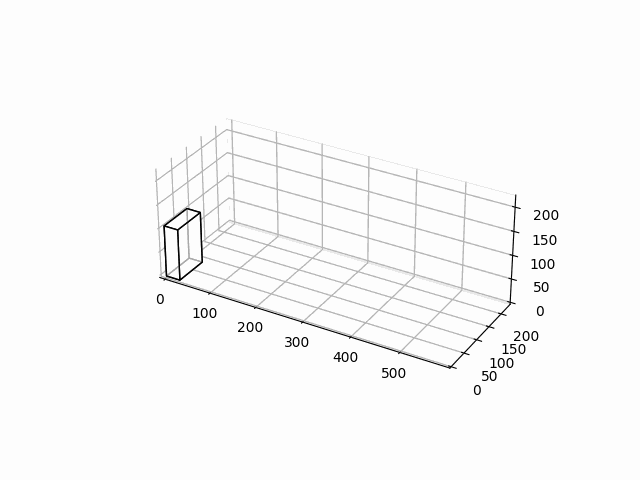
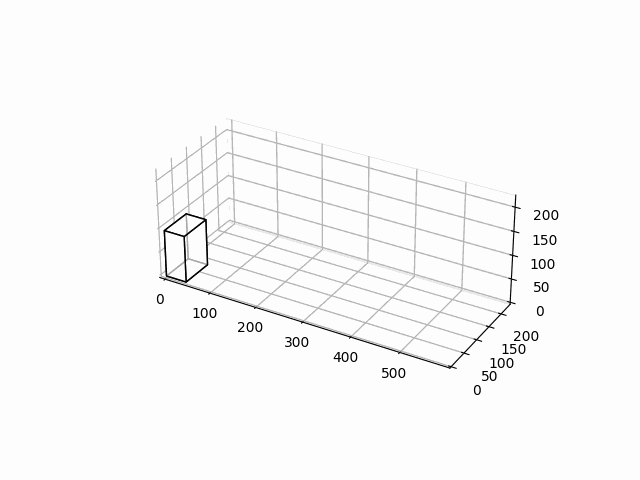

<div align=center>
<font size='70'>算法报告</font>
</div>
<center>25小组</center>
<center>王涛 2022202210085</center>
<center>方正 2022202210118</center>

# 一、问题背景

物流公司在流通过程中，需要将打包完毕的箱子装入到一个货车的车厢中，为了提高物流效率，需要将车厢尽量填满，显然，车厢如果能被100%填满是最优的，但通常认为，车厢能够填满85%，可认为装箱是比较优化的。

# 二、问题描述

设车厢为长方形，其长宽高分别为$L,W,H$。共有$n$个箱子，箱子也为长方形，第$i$个箱子的长宽高为$l_i,w_i,h_i$($n$个箱子的体积总和是要远远大于车厢的体积），做以下假设和要求：
1. 长方形的车厢共有8个角，并设靠近驾驶室并位于下端的一个角的坐标为$(0,0,0)$，车厢共6个面，其中长的4个面，以及靠近驾驶室的面是封闭的，只有一个面是开着的，用于工人搬运箱子；
2. 需要计算出每个箱子在车厢中的坐标，即每个箱子摆放后，其和车厢坐标为$(0,0,0)$的角相对应的角在车厢中的坐标，并计算车厢的填充率。

# 三、问题要求

## 3.1 基础部分问题要求

1. 所有的参数为整数；
2. 静态装箱，即从$n$个箱子中选取$m$个箱子，并实现$m$个箱子在车厢中的摆放（无需考虑装箱的顺序，即不需要考虑箱子从内向外，从下向上这种在车厢中的装箱顺序）；
3. 所有的箱子全部平放，即箱子的最大面朝下摆放；
4. 算法时间不做严格要求，只要1天内得出结果都可。
## 3.2 高级部分问题要求
1. 参数考虑小数点后两位；
2. 实现在线算法，也就是箱子是按照随机顺序到达，先到达先摆放；
3. 需要考虑箱子的摆放顺序，即箱子是从内到外，从下向上的摆放顺序；
4. 因箱子共有3个不同的面，所有每个箱子有3种不同的摆放状态；
5. 算法需要实时得出结果，即算法时间小于等于2秒。

# 四、问题分析

## 4.1 离散化
由于问题中箱子和车厢的尺寸若采用实数表示，将不好表示车厢空间，浮点数的精度与误差也将给问题求解带来困难，因此考虑将车厢与箱子的尺寸都进行离散化。
在这里，考虑到高级部分需要考虑两位小数，因此最简单直接的办法就是将各尺寸均乘以100，四舍五入后取其整数部分。因此，我们设置了一个$PRECISION$参数以控制读入数据的精度。具体来说，读入的数据将被乘以$10^{PRECISION}$，并取整数部分。这样控制读入精度还能够为今后更好的泛化打下基础。
## 4.2 车厢空间表示
在该问题中，车厢空间可以有多种表示方式，下面分别描述：
1. 直接表示：以一个三维数组描述车厢空间。经离散化后，车厢空间就可以用一个三维数组来表示了。在本算法中，以0表示该位置为空，以1表示该位置被占。当放入一个箱子时，就将其所在的位置所有元素置为1。
2. 包络表示：以一个三维数组描述车厢空间。与直接表示类似，但不同的是，当放入一个箱子时，将从$(0,0,0)$到箱子最外端的点构成的长方体中的所有元素都置为1。这样使得该空间中，为1（也即“被占”）的位置的最外围（也即其包络）沿着车厢的各个维度单调递减。这种表示简化了问题，提高了问题求解的速度。
3. 重力表示：以一个二维数组描述车厢空间。注意到，高度这一维度是特殊的，因为需要考虑箱子在车厢中不会掉落这一情况。因此，在该种表示中，只记录每个地面位置对应箱子的最高高度。当放入一个箱子时，首先判断箱子所在位置在地面的投影，并计算该投影位置上的所有元素的最大值，以此代表箱子被放置的高度。在该种表示方法中，由于取的是投影位置上高度的最大值，因此将浪费部分空间。
   

# 五、代码运行说明

## 5.1 环境配置

### 5.1.1 硬件配置

一台计算机

### 5.1.2 软件配置

#### 5.1.2.1 系统配置

Windows 7（不包含）以上的Windows版本

#### 5.1.2.2 编程语言版本

python 3.10及以上

#### 5.1.2.3 包配置

| 包名称      | 版本   |
| ----------- | ------ |
| matplotlib  | 3.6.0  |
| numpy       | 1.23.3 |
| verboselogs | 1.7    |

## 5.2 命令行参数说明

无默认值代表必须输入的参数

### 5.2.1 任务选择

| 参数           | 含义           | 选项          | 默认值      |
| -------------- | -------------- | ------------- | ----------- |
| --bin_types    | 箱子的种类     | [3,5,8,10,15] |             |
| --test_index   | 具体的任务索引 | [0,1,2,3,4,5] | 0，表示随机 |
| --strict_level | 箱子稳定性等级 | [0,1,2,3]     | 2           |

### 5.2.2 类型选择

| 参数   | 含义               | 选项                  | 默认值 |
| ------ | ------------------ | --------------------- | ------ |
| --type | 选择离线或在线算法 | ["online", "offline"] |        |

### 5.2.3 方法选择

#### 5.2.3.1 在线方法选择

| 参数     | 含义         | 选项                                                 | 默认值 |
| -------- | ------------ | ---------------------------------------------------- | ------ |
| --method | 在线方法选择 | ["brute", "greedy", "candidate_points", "sub_space"] |        |

#### 5.2.3.2 离线方法选择

| 参数     | 含义         | 选项                 | 默认值 |
| -------- | ------------ | -------------------- | ------ |
| --method | 离线方法选择 | ["candidate_points"] |        |

### 5.2.4 方法参数设置

#### 5.2.3.1 方法通用参数

| 参数            | 含义               | 选项       | 默认值 |
| --------------- | ------------------ | ---------- | ------ |
| --axises_rotate | 初始箱子的旋转方式 | 六种轴变换 | l w h  |

#### 5.2.3.2 在线算法参数

##### 5.2.3.2.1 带优化的暴力搜索

| 参数     | 含义         | 选项       | 默认值 |
| -------- | ------------ | ---------- | ------ |
| --axises | 搜索的轴顺序 | 六种轴变换 | l w h  |

##### 5.2.3.2.2 贪心算法

| 参数     | 含义         | 选项       | 默认值 |
| -------- | ------------ | ---------- | ------ |
| --axises | 搜索的轴顺序 | 六种轴变换 | l w h  |

##### 5.2.3.2.3 候选点搜索

| 参数                    | 含义                               | 选项                                    | 默认值  |
| ----------------------- | ---------------------------------- | --------------------------------------- | ------- |
| --candidate_add_method  | 候选点添加方法                     | ["axis", "surround", "envelope", "all"] | all     |
| --candidate_sort_method | 候选点排序方法                     | ["axis", "sum_min", "portion_min"]      | sum_min |
| --axises                | 当候选点排序方法为axis时的排序依据 | 六种轴变换                              | l w h   |
| --try_rotate            | 是否尝试旋转                       | 在命令行出现与否                        | False   |

#### 5.2.3.3 离线算法参数

##### 5.2.3.3.1 贪心+候选点算法

| 参数                    | 含义                               | 选项                                                         | 默认值          |
| ----------------------- | ---------------------------------- | ------------------------------------------------------------ | --------------- |
| --bin_sort_method       | 箱子的排序方法                     | ["volumn_min", "volumn_max", "portion_similar", "approximate_max"] | approximate_max |
| --candidate_add_method  | 候选点添加方法                     | ["axis", "surround", "envelope", "all"]                      | all             |
| --candidate_sort_method | 候选点排序方法                     | ["axis", "sum_min", "portion_min"]                           | sum_min         |
| --axises                | 当候选点排序方法为axis时的排序依据 | 六种轴变换                                                   | l w h           |

# 六、数据集预处理

为了方便进行批量测试，有必要将3DLoad-test-dataSet.docx提供的数据集处理为一种方便读取和测试的形式。

首先，通过python脚本将3DLoad-test-dataSet.docx中的多个测试样例进行读取与分割。每个测试样例的形式都是一致的，如下所示：

```txt
  //E1-1
  C (587 233 220)
  B [(108 76 30 40), (110 43 25 33), (92 81 55 39)]
```

由此，可以将整个文件直接读入一个txt文件，并进行如下处理：

## 6.1 去除注释行

```python
lines = [line.strip() for line in lines]
lines = ["" if line.startswith("/") else line for line in lines]
lines = ["" if line.startswith("\n") else line for line in lines]
```

## 6.2 读入车厢和箱子信息

对车厢的判断：

```python
line.startswith("C")
```

对车厢的处理：

```python
ml, mw, mh = line.split("(")[1].split(")")[0].split(" ")
ml, mw, mh = int(ml), int(mw), int(mh)
new_container = Container(ml, mw, mh, precision)
container_list.append(new_container)
```

对箱子的判断：

```python
line.startswith("B")
```

对箱子的处理：

```python
str_bins = line.split("[")[1].split("]")[0].split(",")
str_bins = [str_bin.strip() for str_bin in str_bins]
bin_type = len(str_bins)
bin_list = []
for str_bin in str_bins:
  l, w, h, n = str_bin.split("(")[1].split(")")[0].split(" ")
  l, w, h, n = int(l), int(w), int(h), int(n)
  for i in range(n):
    new_bin = Bin(l, w, h, precision)
    bin_list.append(new_bin)
bins_list.append(bin_list)
types_list.append(bin_type)
```

## 6.3 根据参数选择测试数据

根据命令行参数选择正确的测试数据，返回实例化后的车厢和箱子列表

# 七、算法原理及实现

## 7.1 文件描述及类定义

### 7.1.1 核心文件

#### 7.1.1.1 Bin

包含Bin类，其为箱子的实体类，具有如下属性：
|      属性      |         含义         |
|:-:|:-:|
|       l        |       实际长度       |
|       w        |       实际宽度       |
|       h        |       实际高度       |
|   precision    |         精度         |
|     length     | 离散化后算法中的长度 |
|     width      | 离散化后算法中的宽度 |
|     height     | 离散化后算法中的高度 |
|     volume     | 离散化后算法中的体积 |
| priority | 箱子的优先级 |
| size_list | 箱子的尺寸列表 |

Bin类具有如下方法：

| 方法           | 含义                                         | 示例                                                         |
| -------------- | -------------------------------------------- | ------------------------------------------------------------ |
| copy           | 返回本箱子的复制品                           |                                                              |
| axis_sort      | 传入三个轴，箱子的尺寸将按照这三个轴升序排列 | 传入（长，高，宽），则返回一个长最短，高次之，宽最长的箱子   |
| axis_transform | 传入三个轴，箱子的尺寸将按照这三个轴进行调换 | 传入（长，高，宽），则返回一个长为原箱子的长，宽为原箱子的高，宽为原箱子的高的箱子 |

此外，文件还具有如下工具方法：

| 方法                  | 含义                     |
| --------------------- | ------------------------ |
| sort_bins_by_priority | 将箱子按其优先级降序排列 |

#### 7.1.1.2 Container

包含Container类，其为车厢容器的实体类，具有如下属性：

|       属性        |           含义           |
| :---------------: | :----------------------: |
|        ml         |       实际最大长度       |
|        mw         |       实际最大宽度       |
|        mh         |       实际最大高度       |
|     precision     |           精度           |
|    max_length     | 离散化后算法中的最大长度 |
|     max_width     | 离散化后算法中的最大宽度 |
|    max_height     | 离散化后算法中的最大高度 |
|      volumn       |   离散化后算法中的体积   |
|       space       |      空间的直接表示      |
|  envelope_space   |      空间的包络表示      |
|   simple_space    |      空间的重力表示      |
| candidates_points |    搜索算法中的候选点    |
| space_utilization |        空间利用率        |


Container类具有如下方法：
|          方法          |                    含义                    |
| :--------------------: | :----------------------------------------: |
|    construct_space     | 构建原始空间表示，适用于直接表示和包络表示 |
| construct_simple_space |      构建原始空间表示，适用于重力表示      |

Container类还具有以下工具方法：

|            方法            |                         含义                         |
| :------------------------: | :--------------------------------------------------: |
|       str_2D_matrix        |        一个矩阵的命令行显示，方便箱子状态查询        |
|       print_2D_slice       | 使用上述矩阵的命令行显示，在命令行打印车厢的特定切面 |
|        point_within        |                判断单个点是否在容器内                |
|           within           |                 判断箱子是否在容器内                 |
|           stable           |        箱子稳定性判断函数，箱子稳定判断的实现        |
|        volumn_check        |        检查容器是否还有至少箱子大小的空位可用        |
|            put             |    放置箱子并更新各空间状态，若放置失败则返回原因    |
|   find_envelope_in_slice   |         子空间搜索使用，寻找单个切面的包络点         |
|        cal_priority        |          离线算法使用，计算各个箱子的优先级          |
|     update_candidates      |                      更新候选点                      |
|       add_candidates       |            在放置箱子后根据参数添加候选点            |
| clear_occupied_candidates  |                  清除被占用的候选点                  |
| clear_duplicate_candidates |                   清除重复的候选点                   |
|      candidates_sort       |                  根据参数排序候选点                  |

Container类还是算法的实现类，其算法将在下面详细介绍

### 7.1.2 工具文件

#### 7.1.2.1 Common

保存各种公用类及变量，包括如下类：

| 类                  | 含义                                           |
| ------------------- | ---------------------------------------------- |
| Axis                | 轴，表示空间中的朝向，用于处理箱子的旋转等变换 |
| Method              | 各种方法的基类                                 |
| OfflineSearchMethod | 离线算法的枚举类                               |
| OnlineSearchMethod  | 在线算法的枚举类                               |
| PointAddMethod      | 添加候选点的方法的枚举类                       |
| PointSortMethod     | 排序候选点的方法的枚举类                       |
| BinSortMethod       | 排序箱子的方法的枚举类                         |

以及如下常量：

| 常量         | 含义               |
| ------------ | ------------------ |
| PRECISION    | 精度               |
| PROJECT_ROOT | 项目根目录         |
| LOG_DIR      | 日志文件的输出目录 |

这里对上述枚举类做一些解释：

| OfflineSearchMethod | 含义             |
| ------------------- | ---------------- |
| CANDIDATE_POINTS    | 以候选点算法求解 |

| OnlineSearchMethod | 含义                       |
| ------------------ | -------------------------- |
| BRUTE              | 以（带优化的）暴力算法求解 |
| GREEDY             | 以贪心算法求解             |
| CANDIDATE_POINTS   | 以候选点算法求解           |
| SUB_SPACE          | 以子空间算法求解           |

| PointAddMethod | 含义                                                         |
| -------------- | ------------------------------------------------------------ |
| AXIS           | 添加轴向（将箱子的放置点沿着三个轴分别移动箱子的长、宽、高）的3个点 |
| SURROUND       | 添加包围箱子的7个点。分别为：将箱子的放置点沿着三个轴分别移动箱子的长、宽、高；将箱子的放置点沿着三个轴中的两个移动，即上面两种移动方式的组合；将箱子的放置点沿着三个轴移动，即上面三种移动方式的组合 |
| ENVELOPE       | 添加以箱子的外部3个面的切面上的包络点。以刚放置的箱子的“外”三个平面作为切分箱子的切面，在每个切面上寻找包络线的转折点（因为在包络线表示中，每个箱子放入时都将其最外侧点与原点构成的长方体置为1，因此此时的包络表示中该切面一定呈现一个“阶梯”形状） |
| ALL            | 添加上述所有点                                               |

| PointSortMethod | 含义                                         |
| --------------- | -------------------------------------------- |
| AXIS            | 按照指定轴排序                               |
| SUM_MIN         | 按照点坐标之和排序                           |
| PORTION_MIN     | 将车厢缩放为正方体后，按照对应点坐标之和排序 |

| BinSortMethod   | 含义                                                         |
| --------------- | ------------------------------------------------------------ |
| VOLUMN_MIN      | 以箱子的体积作为优先值，体积小的优先                         |
| VOLUMN_MAX      | 以箱子的体积作为优先值，体积大的优先                         |
| PORTION_SIMILAR | 计算箱子与车厢的相似程度，并将相似值作为箱子的优先级         |
| APPROXIMATE_MAX | 计算箱子以当前状态装入车厢时最多可以装入的个数与该状态下车厢的利用率，并将该利用率作为箱子的优先级 |

#### 7.1.2.2 args_utils

处理命令行参数，设置各个参数的初始值，将输入的参数转化为程序可用的格式，包含如下方法：

| 方法                 | 含义                         |
| -------------------- | ---------------------------- |
| to_axis              | 将参数转换为轴               |
| to_online_method     | 将参数转换为在线算法         |
| to_offline_method    | 将参数转换为离线算法         |
| to_bin_sort_method   | 将参数转换为排序箱子的方法   |
| to_point_add_method  | 将参数转换为添加候选点的方法 |
| to_point_sort_method | 将参数转换为排序候选点的方法 |
| get_args             | 获得命令行参数并处理         |

#### 7.1.2.3 axis_utils

处理有关轴的有关问题，包含如下方法：

| 方法            | 含义                                 | 示例                                                         |
| --------------- | ------------------------------------ | ------------------------------------------------------------ |
| valid_axis      | 判断输入的三个轴是否合法             |                                                              |
| lwh_to_axis_map | 将长宽高按传入参数转化为各轴的映射表 |                                                              |
| axis_to_lwh_map | 将各轴按传入参数转化为长宽高的映射表 |                                                              |
| lwh_to_axis     | 将长宽高按传入参数转化为各轴         | 传入长宽高为（1,2,3）按照（高，长，宽）变换，即变为轴（3,1,2） |
| axis_to_lwh     | 将各轴按传入参数转化为长宽高         | 传入轴（1,2,3）按照（高，长，宽）变换，即变为长宽高（2,3,1） |
| full_axis_type  | 箱子的全部轴类型                     |                                                              |
| lwh_sort        | 按照传入的长宽高返回轴的排序         | 传入长宽高为（4,2,3），则返回（宽，高，长）                  |

#### 7.1.2.4 data_utils

处理数据的文件，包含如下方法：

| 方法          | 含义                             |
| ------------- | -------------------------------- |
| generate_bins | 根据车厢随机生成箱子，早期测试用 |
| read_task     | 根据参数读入老师所给定的任务配置 |

#### 7.1.2.5 log_utils

处理日志的文件，包含如下类：

| 类           | 含义           |
| ------------ | -------------- |
| SingleLogger | 单例的Logger类 |

#### 7.1.2.6 math_utils

处理有关数学的运算，包含如下方法：

| 方法         | 含义                            |
| ------------ | ------------------------------- |
| to_precision | 将读入的数据按照PRECISION离散化 |

#### 7.1.2.7 plot_utils

处理有关绘图的操作，包含如下方法：

| 方法      | 含义                       |
| --------- | -------------------------- |
| make_data | 生成长方体面的数据         |
| make_3D   | 创建matplotlib支持的3D数据 |
| draw      | 绘制车厢的静态3D图片       |
| anime     | 绘制车厢装载的动态3D图片   |

## 7.2 算法说明

### 7.2.1 离线算法说明

由Container类中的offline_search方法实现，通过传入参数以选择和配置不同算法

#### 7.2.1.1 离线算法考虑的范围

考虑基础部分的全部要求

#### 7.2.1.2 贪心+候选点算法

通过传入OfflineSearchMethod.CANDIDATE_POINTS以选择本方法

##### 7.2.1.2.1 算法步骤

首先根据装入的箱子计算其优先级，优先级计算方式由参数bin_sort_method指定。将所有箱子按照其优先级排序。

然后将候选点列表初始化为仅包含原点的列表

最后，将上述排好序的箱子中第一个箱子取出，并尝试将其放入候选点列表中的第一个位置。若可以放下，则就将箱子放在此处，删除当前候选点，并在候选点列表中添加候选点，添加方法由candidate_add_method参数指定。添加完后将候选点列表按照参数candidate_sort_method指定的方式排序。

重复上一步骤直至箱子放不下为止，算法结束。

##### 7.2.1.2.2 算法分析

上述过程利用箱子的优先值进行贪心，并利用候选点减少了空间的搜索。

### 7.2.2 在线算法说明

#### 7.2.2.1 在线算法考虑的范围

在离线算法的基础上，增加了如下几点判断：

1. 箱子稳定判断
   在该问题中，由于需要考虑重力的因素，因此设计了一个stable指标以判断箱子在某一位置是否稳定。但是，过于严格的判断会导致虽然有时候箱子可以放置在该位置，但却由于不稳定而放弃该位置。因此，我们设计了strict_level这一参数以控制判断等级，具体如下：
   
   | strict_level | 含义                                                         |
   | ------------ | ------------------------------------------------------------ |
   | 3            | 最严格的判断。只有当箱子底层的四角都有东西支撑时，箱子才可以被放置在该位置。这是为了防止如果箱子上部还要放置箱子时，本箱子会发生倾倒或变形。这也是确保箱子上压箱子时，本箱子不发生倾倒的充要条件。此条件也最符合现实生活的情况。 |
   | 2            | 较严格的判断。当箱子底层存在东西支撑时，箱子才可以被放置在该位置。在该情况下，箱子是不稳定的，但存在一定支撑，在现实生活中可以采用泡沫垫材等模拟该种限制。 |
   | 1            | 较松弛的判断。当箱子底层的平面存在东西支撑时，箱子才可以被放置在该位置。在该情况下，箱子不至于完全悬于空中（指至少可以通过填充少于一层的材料使得箱子得到支撑）。 |
   | 0            | 无判断。只要可以放下，箱子可以被放在任意位置。               |

2. 在线算法
   箱子依照顺序而来，此时算法并不能提前知道后续来到的箱子形状，只能根据当前容器中的状态来判断下一个箱子的放置位置。因此Bin类的属性priority无法使用。
3. 

#### 7.2.2.2 带优化的暴力搜索

##### 7.2.2.2.1 算法步骤

这是最简单的搜索方法。利用车厢的直接表示，用户可以指定搜索的轴顺序，即按照何种顺序遍历。在该种算法中，逐个位置遍历整个车厢空间，如果找到一个可以放置箱子的位置，就将箱子放置在此处。在这里，我们对暴力搜索进行了一定优化，缩短了搜索时间，方法包括：

1. 末尾跳过：当某一维度剩余长度小于该箱子对应维度的长度时，直接跳过该维度剩余的搜索，进行下一次搜索
2. 起始点：设定起始点，可以通过调整搜索起始点加速搜索
3. 切片判断：当前索引的切片中剩余面积与箱子对应面积比较，若不足时跳过该维度剩余的搜索，进行下一次搜索
4. 搜索历史：当上一个同类型的箱子在某处找到可放置位置时，从当前位置继续搜索；当上一个同类型的箱子无法找到位置时，直接放弃搜索

##### 7.2.2.2.2 算法分析

单纯的暴力算法不能利用任何有关箱子的信息，也不能利用任何有关车厢的信息，搜索时间缓慢。但是带有上述优化策略后可以有效加快搜索。

#### 7.2.2.3 候选点搜索

##### 7.2.2.3.1 算法步骤

利用车厢的直接表示，在开始时，首先将原点（0,0，0）作为第一个候选点。随后，每次要放入箱子时。先在候选点中遍历，若某一个候选点能够放下该箱子，就将其放在此处。放下箱子后，每个箱子根据candidate_add_method参数产生若干个候选点，将上述候选点添加到候选点列表中，并进行去重（也包括去除不可行的候选点，如已经被占用的候选点）并按照candidate_sort_method排序。若在候选点中无法找到可行的放置点，则退回上述暴力搜索方法。此外，在放置箱子时，可以选择是否进行对箱子进行旋转，以期某种箱子的摆放位置可以放入该位置。

##### 7.2.2.3.2 算法分析

因为对箱子的放置位置做了限制，仅可以在候选点中搜索，可以更快地进行搜索。但是可能由于候选点的添加和排序不当造成空间利用率不高。

#### 7.2.2.4 贪心算法

##### 7.2.2.4.1 算法步骤

在这一算法中，利用车厢的重力表示。与暴力搜索类似，本算法从（0,0）开始搜索，并寻找第一个可以放下箱子的位置（具体地，利用车厢的高度减去箱子投影部分的最高高度，若该值大于箱子的高度，则说明可以放下）。若可以放下，则在该位置放置箱子，将箱子投影部分的高度设置为原最高高度+箱子高度。若在候选点中无法找到可行的放置点，则退回上述暴力搜索方法。

##### 7.2.2.4.2 算法分析

该算法实际上是将全部箱子“接地”，也即不考虑中间箱子“突出”的情况，直接将箱子及其投影部分的空间都视作占满。这样的假设虽然浪费一定的空间，但效率更高。因为对箱子的放置位置做了限制，可以更快地进行搜索。

#### 7.2.2.5 子空间搜索

##### 7.2.2.5.1 算法步骤

在这一算法中，利用车厢的包络表示。与候选点搜索类似，在开始时，首先将原点（0,0，0）作为第一个候选点。随后，每次要放入箱子时。先在候选点中遍历，若某一个候选点能够放下该箱子，就将其放在此处。放下箱子后，以参数candidate_add_method产生不确定个数的候选点。将这些点检查后（检查其是否为三维的转折点，直观来说，就是一个“角落”）作为候选点。若在候选点中无法找到可行的放置点，则退回上述暴力搜索方法。

##### 7.2.2.5.2 算法分析

严格来说，这是另一种候选点搜索，可以通过参数设置改变候选点的添加与排序变为此种方法，现已将两者合并。

# 八、算法结果

表中的“得分”一栏为(车厢利用率/理论最大利用率)*100，作为评价各方法优劣的指标。

## 8.1 离线算法结果

3种箱子的实验结果如下表：

|数据|总运行时间(s)|车厢利用率(%)|理论最大利用率(%)|得分|
|:-:|:-:|:-:|:-:|---|
|E1-1|1.6|79.76|98.83|80.70|
|E1-2|1.15|78.79|99.44|79.23|
|E1-3|1.12|78.79|99.44|79.23|
|E1-4|2.11|84.3|99.44|84.77|
|E1-5|2.31|76.2|99.89|76.28|
|总体|1.66|79.57|99.41|80.04|

5种箱子的实验结果如下表：

| 数据 | 总运行时间(s) | 车厢利用率(%) | 理论最大利用率(%) | 得分  |
| :--: | :-----------: | :-----------: | :---------------: | ----- |
| E2-1 |     1.15      |     79.75     |       98.82       | 80.70 |
| E2-2 |     1.67      |     83.48     |       99.92       | 83.55 |
| E2-3 |     1.73      |     80.58     |       99.72       | 80.81 |
| E2-4 |     1.40      |     76.69     |       99.98       | 76.71 |
| E2-5 |     1.34      |     76.4      |       99.67       | 76.65 |
| 总体 |     1.46      |     79.38     |       99.62       | 79.68 |

8种箱子的实验结果如下表：

|数据|总运行时间(s)|车厢利用率(%)|理论最大利用率(%)|得分|
|:-:|:-:|:-:|:-:|---|
|E3-1|1.40|86.72|99.67|87.01|
|E3-2|2.08|82.45|99.98|82.47|
|E3-3|1.80|86.43|99.83|86.58|
|E3-4|1.65|79.28|99.78|79.45|
|E3-5|2.50|77.76|99.61|78.06|
|总体|1.89|82.53|99.77|82.72|

10种箱子的实验结果如下表：

|数据| 总运行时间(s) | 车厢利用率(%) | 理论最大利用率(%) | 得分  |
|:-:|:-:|:-:|:-:|---|
|E4-1|1.90|88.69|98.94|89.64|
|E4-2|1.87|79.71|99.82|79.85|
|E4-3|1.67|72.76|99.52|73.11|
|E4-4|2.41|87.04|99.79|87.22|
|E4-5|2.05|83.81|99.61|84.14|
|总体|1.98|82.40|99.54|82.78|

15种箱子的实验结果如下表：
|数据| 总运行时间(s) | 车厢利用率(%) | 理论最大利用率(%) | 得分  |
|:-:|:-:|:-:|:-:|---|
|E5-1|1.44|78.61|99.01|79.40|
|E5-2|1.77|81.6|99.73|81.82|
|E5-3|2.18|82.76|99.84|82.89|
|E5-4|1.86|74.01|99.73|74.21|
|E5-5|2.03|74.16|99.75|74.35|
|总体|1.86|78.23|99.61|78.54|

总共25个测试数据集的平均利用率为80.42%，平均理论最大利用率为99.59%，平均运行时间为1.77s，平均得分80.75

## 8.2 在线算法结果

### 8.2.1 暴力搜索


|数据|总运行时间(s)|单个箱子运行时间(s)|车厢利用率(%)|理论最大利用率(%)|得分|
|:-:|:-:|:-:|:-:|:-:|:-:|
| E1-1 |     76.88     |        0.69         |     70.22     |       98.83       | 71.06 |
| E1-2 |    124.03     |        1.44         |     75.85     |       99.44       | 76.27 |
| E1-3 |     77.36     |        0.90         |     75.85     |       99.44       | 76.27 |
| E1-4 |    329.02     |        1.96         |     70.07     |       99.44       | 70.47 |
| E1-5 |    226.35     |        1.33         |     65.89     |       99.89       | 65.97 |
| E2-1 |    139.21     |        1.72         |     55.59     |       98.82       | 56.25 |
| E2-2 |    343.42     |        3.01         |     75.53     |       99.92       | 75.59 |
| E2-3 |    122.15     |        1.04         |     72.92     |       99.72       | 73.12 |
| E2-4 |     82.14     |        0.70         |     75.08     |       99.98       | 75.09 |
| E2-5 |     24.98     |        0.27         |     82.12     |       99.67       | 82.39 |
| E3-1 |    166.36     |        1.77         |     68.06     |       99.67       | 68.29 |
| E3-2 |    567.98     |        3.97         |     74.69     |       99.98       | 74.71 |
| E3-3 |     32.23     |        0.29         |     75.55     |       99.83       | 75.67 |
| E3-4 |    167.38     |        1.46         |     67.49     |       99.78       | 67.64 |
| E3-5 |    426.90     |        2.31         |     70.02     |       99.61       | 70.30 |
| E4-1 |    350.24     |        2.85         |     76.01     |       98.94       | 76.83 |
| E4-2 |    321.67     |        2.38         |     73.47     |       99.82       | 73.61 |
| E4-3 |    281.02     |        2.13         |     72.68     |       99.52       | 73.03 |
| E4-4 |    365.95     |        2.17         |     65.72     |       99.79       | 65.86 |
| E4-5 |    496.77     |        3.60         |     67.90     |       99.61       | 68.17 |
| E5-1 |    257.09     |        2.43         |     67.36     |       99.01       | 68.04 |
| E5-2 |    220.63     |        1.71         |     76.18     |       99.73       | 76.39 |
| E5-3 |    540.94     |        3.63         |     73.21     |       99.84       | 73.33 |
| E5-4 |    423.17     |        3.07         |     73.54     |       99.73       | 73.74 |
| E5-5 |    322.07     |        2.24         |     61.60     |       99.75       | 61.76 |
### 8.2.2候选点搜索

|数据| 总运行时间(s) | 单个箱子运行时间(s) | 车厢利用率(%) | 理论最大利用率(%) | 得分  |
|:-:|:-:|:-:|:-:|:-:|:-:|
| E1-1 |    308.04     |        2.75         |     75.67     |       98.83       | 76.57 |
| E1-2 |     76.87     |        0.89         |     72.96     |       99.44       | 73.37 |
| E1-3 |     79.26     |        0.92         |     72.96     |       99.44       | 73.37 |
| E1-4 |    266.47     |        1.59         |     76.96     |       99.44       | 77.39 |
| E1-5 |    169.79     |        1.00         |     76.20     |       99.89       | 76.28 |
| E2-1 |     30.97     |        0.38         |     75.77     |       98.82       | 76.67 |
| E2-2 |     53.86     |        0.47         |     81.64     |       99.92       | 81.70 |
| E2-3 |     24.15     |        0.21         |     80.58     |       99.72       | 80.80 |
| E2-4 |    129.78     |        1.10         |     78.41     |       99.98       | 78.43 |
| E2-5 |     32.54     |        0.35         |     83.09     |       99.67       | 83.36 |
| E3-1 |    156.15     |        1.66         |     75.71     |       99.67       | 75.96 |
| E3-2 |    131.20     |        0.92         |     75.90     |       99.98       | 75.92 |
| E3-3 |     89.71     |        0.79         |     78.17     |       99.83       | 78.31 |
| E3-4 |    177.83     |        1.55         |     70.91     |       99.78       | 71.07 |
| E3-5 |    358.00     |        1.94         |     73.93     |       99.61       | 74.22 |
| E4-1 |    227.54     |        1.85         |     79.74     |       98.94       | 80.59 |
| E4-2 |    147.38     |        1.09         |     69.16     |       99.82       | 69.29 |
| E4-3 |    347.96     |        2.64         |     69.33     |       99.52       | 69.67 |
| E4-4 |     28.12     |        0.17         |     70.04     |       99.79       | 70.19 |
| E4-5 |     61.28     |        0.44         |     64.95     |       99.61       | 65.20 |
| E5-1 |     31.26     |        0.29         |     70.54     |       99.01       | 71.25 |
| E5-2 |     31.58     |        0.24         |     76.78     |       99.73       | 76.98 |
| E5-3 |     65.52     |        0.44         |     73.59     |       99.84       | 73.71 |
| E5-4 |    117.94     |        0.85         |     67.59     |       99.73       | 67.77 |
| E5-5 |     55.14     |        0.38         |     61.60     |       99.75       | 61.76 |

### 8.2.3贪心算法

|数据| 总运行时间(s) | 单个箱子运行时间(s) | 车厢利用率(%) | 理论最大利用率(%) | 得分  |
|:-:|:-:|:-:|:-:|:-:|:-:|
| E1-1 |    226.59     |        2.02         |     70.22     |       98.83       | 71.06 |
| E1-2 |    118.29     |        1.38         |     75.85     |       99.44       | 76.27 |
| E1-3 |    116.66     |        1.36         |     75.85     |       99.44       | 76.27 |
| E1-4 |    406.16     |        2.42         |     67.88     |       99.44       | 68.26 |
| E1-5 |    159.66     |        0.94         |     65.89     |       99.89       | 65.97 |
| E2-1 |    340.87     |        4.21         |     55.59     |       98.82       | 56.25 |
| E2-2 |    398.42     |        3.49         |     75.53     |       99.92       | 75.59 |
| E2-3 |     28.73     |        0.25         |     72.92     |       99.72       | 73.12 |
| E2-4 |     28.55     |        0.24         |     75.08     |       99.98       | 75.09 |
| E2-5 |     73.90     |        0.79         |     81.45     |       99.67       | 81.72 |
| E3-1 |    170.83     |        1.82         |     71.47     |       99.67       | 71.70 |
| E3-2 |    531.97     |        3.72         |     70.46     |       99.98       | 70.47 |
| E3-3 |     58.26     |        0.52         |     75.55     |       99.83       | 75.67 |
| E3-4 |    128.82     |        1.12         |     76.04     |       99.78       | 76.20 |
| E3-5 |     49.34     |        0.27         |     72.82     |       99.61       | 73.11 |
| E4-1 |    508.76     |        4.14         |     76.80     |       98.94       | 77.63 |
| E4-2 |    975.28     |        7.22         |     69.39     |       99.82       | 69.52 |
| E4-3 |     34.60     |        0.26         |     73.78     |       99.52       | 74.14 |
| E4-4 |     37.33     |        0.22         |     69.26     |       99.79       | 69.40 |
| E4-5 |     31.29     |        0.23         |     62.34     |       99.61       | 62.59 |
| E5-1 |     28.65     |        0.27         |     71.80     |       99.01       | 72.48 |
| E5-2 |     29.08     |        0.23         |     79.20     |       99.73       | 79.41 |
| E5-3 |    1559.33    |        10.47        |     64.90     |       99.84       | 65.00 |
| E5-4 |    1494.40    |        10.83        |     73.40     |       99.73       | 73.60 |
| E5-5 |     28.09     |        0.20         |     61.60     |       99.75       | 61.76 |

### 8.2.4子空间搜索

| 数据 | 总运行时间(s) | 单个箱子运行时间(s) | 车厢利用率(%) | 理论最大利用率(%) | 得分  |
| :--: | :-----------: | :-----------------: | :-----------: | :---------------: | :---: |
| E1-1 |     99.39     |        0.89         |     70.22     |       98.83       | 71.06 |
| E1-2 |     5.67      |        0.07         |     77.81     |       99.44       | 78.25 |
| E1-3 |     5.50      |        0.06         |     77.81     |       99.44       | 78.25 |
| E1-4 |     69.29     |        0.41         |     72.83     |       99.44       | 73.24 |
| E1-5 |     98.16     |        0.58         |     61.77     |       99.89       | 61.84 |
| E2-1 |    157.23     |        1.94         |     61.36     |       98.82       | 62.09 |
| E2-2 |     44.84     |        0.39         |     73.69     |       99.92       | 73.75 |
| E2-3 |    113.76     |        0.97         |     69.74     |       99.72       | 69.94 |
| E2-4 |    131.72     |        1.12         |     75.24     |       99.98       | 75.25 |
| E2-5 |     94.80     |        1.01         |     73.39     |       99.67       | 73.63 |
| E3-1 |    1062.10    |        11.30        |     76.58     |       99.67       | 76.84 |
| E3-2 |    304.30     |        2.13         |     72.27     |       99.98       | 72.29 |
| E3-3 |    229.99     |        2.04         |     72.68     |       99.83       | 72.80 |
| E3-4 |    457.34     |        3.98         |     73.44     |       99.78       | 73.60 |
| E3-5 |    239.64     |        1.30         |     73.08     |       99.61       | 73.37 |
| E4-1 |     7.50      |        0.06         |     67.58     |       98.94       | 68.31 |
| E4-2 |     9.35      |        0.07         |     73.63     |       99.82       | 73.76 |
| E4-3 |     7.95      |        0.06         |     60.17     |       99.52       | 60.46 |
| E4-4 |     10.54     |        0.06         |     68.76     |       99.79       | 68.91 |
| E4-5 |     8.70      |        0.06         |     66.42     |       99.61       | 66.69 |
| E5-1 |     7.27      |        0.07         |     64.42     |       99.01       | 65.07 |
| E5-2 |     7.41      |        0.06         |     45.40     |       99.73       | 45.52 |
| E5-3 |     9.09      |        0.06         |     59.88     |       99.84       | 59.97 |
| E5-4 |     8.89      |        0.06         |     69.38     |       99.73       | 69.56 |
| E5-5 |     9.27      |        0.06         |     64.13     |       99.75       | 64.29 |

# 九、可视化演示

下面对部分结果进行可视化结果展示，更多结果请自行运行代码生成。

```bash
python main.py --bin_types 3 --test_index 1 --strict_level 1 --type online --method brute --axises h l w
```



```bash
python main.py --bin_types 3 --test_index 1 --strict_level 1 --type online --method greedy --axises l w
```


```bash
python main.py --bin_types 3 --test_index 1 --strict_level 1 --type online --method candidate_points --candidate_add_method envelope --candidate_sort_method axis --axises w l h --try_rotate
```


```bash
python main.py --bin_types 15 --test_index 1 --strict_level 1 --type online --method brute --axises h l w
```



```bash
python main.py --bin_types 15 --test_index 1 --strict_level 1 --type online --method greedy --axises l w
```


```bash
python main.py --bin_types 15 --test_index 1 --strict_level 1 --type online --method candidate_points --candidate_add_method envelope --candidate_sort_method axis --axises w l h --try_rotate
```


# 十、总结

## 10.1 成果与感悟

在本次实验中，我们小组在不参考其它方法的情况下，自发设计了上述所有算法。正因如此，看到算法可以正常运行且取得不错结果的时候，我们的激动心情是难以自抑的。

在编写代码时，我们经过多版优化，使得参数的输入逻辑、算法的执行逻辑、算法运行信息的记录、最后结果的可视化，以及将来其它算法的可集成性，都有了一个比较满意的结果。

## 10.2 不足与展望

诚然，自己设计算法令人感到激动，但两人的能力终究有限。尝试了上述许多方法，但是正如开头背景所述，车厢利用率达到85%才算较优，我们距离这一目标还有一定的距离，且离这个目标越近，优化就越困难。因此，有必要进一步改进算法，不仅利用我们自己的智慧，也利用他人的一些成果。此外，代码的规范方面也并不令人满意，注释也没有添加。因此，为了进一步改进算法与其代码实现我们已经有了一些改进的方向：

目前的基础部分算法通过权重来确定放置的箱子。虽然与根据体积来放置的方法相比有了一定的性能提升，但是在某一侧放不下权重最大的箱子的时候会对空间造成浪费。因此有了两种改进方法：

1. 在某一侧放不下权重最大的箱子时，对这一侧的空闲区域（通常也是一个长方体）重新计算权重，选择权重最大的箱子进行放置。这样的思想可以延伸为可变的权重，即权重并非固定的，而是随着空闲区域的变化而变化
2. 把箱子组合成块，根据车厢的大小将给定的箱子组合成块。块是箱子的组合，能够尽可能有效的塞满整个车厢。要使车厢的利用率高，只需每一个块的利用率都较高。因此，问题转变为了通过组合箱子来提升块的利用率

除此之外，在线算法中还有如下一些想法：

1. 在put函数中，由于存在strict_level的检查，因此会出现悬空不可放置而错过部分候选点的荒谬情况，因此准备添加箱子的“下落”功能，增加可利用的空间
2. 目前的箱子在放入之前被旋转的方式是固定的，不能根据放置情况改变，这是不合理的，可以从这一方面改进，根据车厢的大小和当前放置的箱子做出放入前的旋转指令
3. 仅在候选点算法中存在try_rotate参数，可以在其它方法中进行添加。当一种放置方案不可行时，可以通过旋转该箱子尝试放入。但是应该对这种放入时的旋转做出一定的限制，因为当前箱子旋转后或许能够放下，但对之后的箱子放入造成困难，就得不偿失。因此何时尝试旋转，以何种方式旋转都是值得考虑的问题。
4. 目前的算法虽然可以通过参数的组合以达到真实的从里到外、从下到上的放置顺序，但没有强制规定，可以在放置时进行限制，更好地模拟真实场景
5. 已经出现了许多装箱问题的高效算法，可以进行复现。在这其中，最近还出现利用神经网络进行求解该问题的算法，个人较感兴趣，可以将其整合进来或者参考其方法以开发新方法
