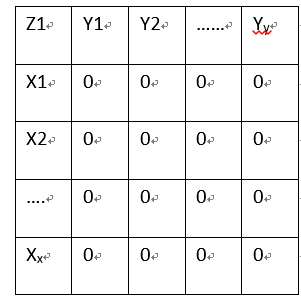
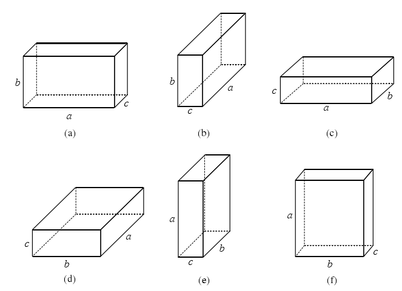
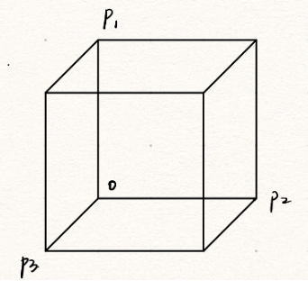
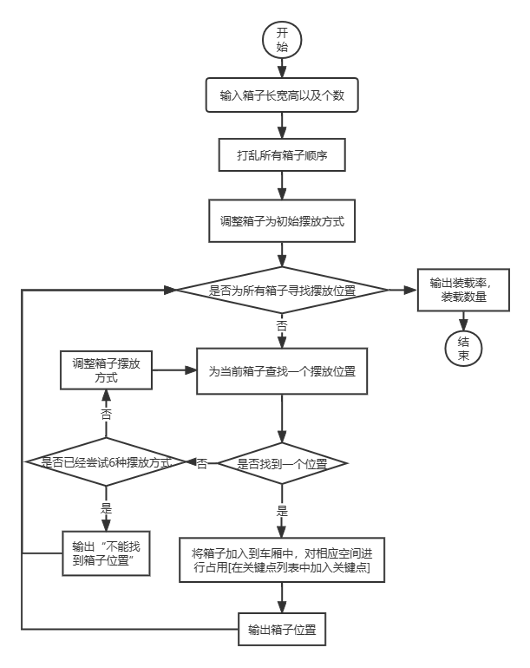
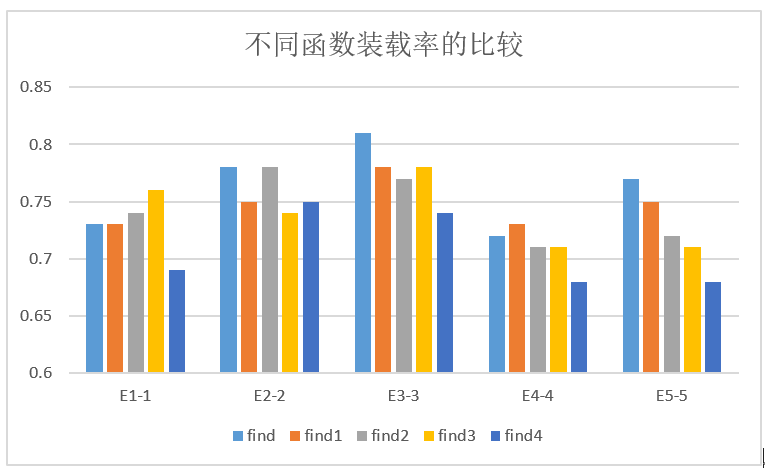
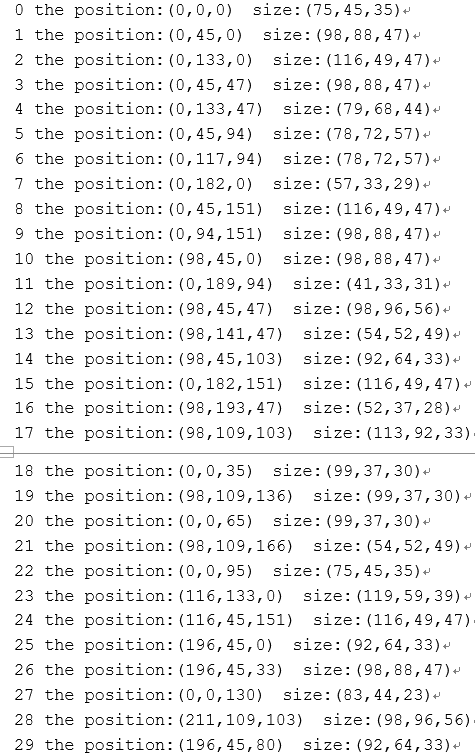

##  问题定义
物流公司在流通过程中，需要将打包完毕的箱子装入到一个货车的车厢中，为了提高物流效率，需要将车厢尽量填满
设车厢为长方形，其长宽高分别为L，W，H；共有n个箱子，箱子也为长方形，第i个箱子的长宽高为li，wi，hi（n个箱子的体积总和是要远远大于车厢的体积），以下为我们所实现的要求：
1. 实现在线算法，也就是箱子是按照随机顺序到达，先到达先摆放；
2. 考虑了箱子的摆放顺序，即箱子是按照从内到外，从下向上的摆放顺序；
3. 实现了箱子的6种摆放状态；
4. 实现了箱子尺寸可以为小数点后两位小数；
## 算法设计思路
##### 1、空间表示
  使用一种空间矩阵表征方式。在XY平面将其划分成长宽均为1的单元格，每个单元格中的数字表示在某一高度范围内，占用该空间的箱子的数量。其表示如图1所示。

  

​                          图1 空间表示
  ##### 2、箱子摆放方式
  箱子六种摆放方式如下图2所示，初始摆放方式如图(c)所示
  

​                                                                       图2 箱子摆放方式
##### 3、寻找合理位置
如何给箱子寻找到一个合理位置，从基础方法出发，逐步进行改进
1. 基础方法，遍历空间中XY平面的所有点，检查以（X,Y）为起点的单元格的占用情况（单元格起点是单元格左上角点的坐标），然后再单独判断Z轴上箱子之间的高度是否冲突。
2. 改进方法1，启发式方法寻找一个合理位置，遍历从车厢空间内所有点（x,y），寻找一个(x’,y’,h)满足以下要求：以(x’,y’,h)为箱子放置位置，箱子放置在车厢时与当前车厢中已有箱子的位置不冲突同时（x+y）和最小。对应代码中find1函数
3. 改进方法2，寻找待放入箱子位置时不再以1为单位判断每个单元格的占用情况，而是记录车厢中已有箱子的长宽高，遍历车厢中已有箱子，直接判断当前箱子和车厢内已有箱子的位置冲突，对应代码中find2函数
4. 改进方法3，使用关键点遍历算法。如图3所示的一个箱子中，点O为箱子在车厢中的放置位置，箱子的三个关键点为P1,P2,P3。 当车厢中未摆放箱子时，只有一个关键点（0，0，0)。我们定义三个列表，分别存放宽关键点、高关键点和长关键点，当需要放入一个箱子时，按顺序遍历宽、高、长关键点集合，检查将箱子放置在当前关键点上与当前车厢中已有箱子的位置是否冲突。没有冲突时该物品便占用该关键点，从而将该关键点从列表中删除，然后增加三个关键点。对应代码中find3、find4函数。其中find3和find4函数主要区别在于find3是以及基础方法来判断位置冲突，find4是基于改进方法2来判断位置冲突。

 

​                             图3 箱子关键点

基础方法关键代码

```cpp
Point find(const Box vehicle, Box a) {
		int cur_h = 0;
		for(int i = 0; i < vehicle.length; i++) {
			for(int j = 0; j < vehicle.width; j++) {
				cur_h = 0;
				if(queryOnePosition(vehicle, a, i, j, cur_h) == 1)
					return Point(i, j ,cur_h);
				for(int k = 0; k < loaded[i][j].count; k++){
					cur_h = loaded[i][j].start[k] + loaded[i][j].h[k];
					if(queryOnePosition(vehicle, a, i, j, cur_h) == 1)
						return Point(i, j ,cur_h);
				}
			}
		}
		return Point(-1, -1, -1);
	}
```
使用关键点遍历对应的关键代码

```cpp
Point find4(const Box vehicle, vector<BPoint> BPox, Box a, list<Point> &lis_l, list<Point> &lis_w, list<Point> &lis_h) {
    list<Point>::iterator iter;
    for(iter = lis_w.begin(); iter != lis_w.end( ); iter++) {
        if(iter->l + a.length >= vehicle.length || iter->w + a.width >= vehicle.width ||
           iter->h + a.height >= vehicle.height){
            continue;
        }
        int flag = 0;
        for(int t = 0; t < BPox.size(); t++) {
            //如果查到有重合则推出循环
            BPoint bp = BPoint(Point(iter->l, iter->w, iter->h), a.length, a.width, a.height);
            if(verify(bp, BPox[t]) == 0) {
                flag = 1;
                break;
            }
        }
        if(flag == 1)
            continue;
        Point P = Point(iter->l, iter->w, iter->h);
        lis_w.erase(iter);
        return P;
    }
    for(iter = lis_h.begin(); iter != lis_h.end( ); iter++) {
        if(iter->l + a.length >= vehicle.length || iter->w + a.width >= vehicle.width ||
           iter->h + a.height >= vehicle.height){
            continue;
        }
        int flag = 0;
        for(int t = 0; t < BPox.size(); t++) {
            //如果查到有重合则推出循环
            BPoint bp = BPoint(Point(iter->l, iter->w, iter->h), a.length, a.width, a.height);
            if(verify(bp, BPox[t]) == 0) {
                flag = 1;
                break;
            }
        }
        if(flag == 1)
            continue;
        Point P = Point(iter->l, iter->w, iter->h);
        lis_h.erase(iter);
        return P;
    }
    for(iter = lis_l.begin(); iter != lis_l.end( ); iter++) {
        if(iter->l + a.length >= vehicle.length || iter->w + a.width >= vehicle.width ||
           iter->h + a.height >= vehicle.height){
            continue;
        }
        int flag = 0;
        for(int t = 0; t < BPox.size(); t++) {
            //如果查到有重合则推出循环
            BPoint bp = BPoint(Point(iter->l, iter->w, iter->h), a.length, a.width, a.height);
            if(verify(bp, BPox[t]) == 0) {
                flag = 1;
                break;
            }
        }
        if(flag == 1)
            continue;
        Point P = Point(iter->l, iter->w, iter->h);
        lis_l.erase(iter);
        return P;
    }
    return Point(-1, -1, -1);
	}
```
##### 4、装载
 每次新到来一个箱子，便为其寻找合理位置，如果找不到，则对其进行翻转，直到6种摆放状态全部尝试过，如果都不能找到位置，则认为无法装入，否则进行装入，同时更新已装载空间。具体代码如下所示
	
```cpp
	int upload1(const Box vehicle, vector<Box> &stuff) {
    double sum = 0;
    vector<BPoint> BPox;
    list<Point> key_l, key_w, key_h;
    for(int i = 0; i < stuff.size(); i++) {
        if(BPox.size() == 0) {
            BPox.push_back(BPoint(Point(0, 0, 0), stuff[i].length, stuff[i].width, stuff[i].height));
            //初始三个关键点
            key_w.push_back(Point(0, stuff[i].width, 0));
            key_h.push_back(Point(0, 0, stuff[i].height));
            key_l.push_back(Point(stuff[i].length, 0, 0));
            cout << i << " the position:(0,0,0)  size:" <<  '('<< (double)stuff[i].length/100 << ',' << (double)stuff[i].width/100 << ',' << (double)stuff[i].height/100 << ')' << endl;
            sum += (double)stuff[i].length/100 * (double)stuff[i].width/100 * (double)stuff[i].height/100;
            continue;
        }
        Point pos = find4(vehicle, BPox, stuff[i], key_l, key_w, key_h);
        int cnt = 0;
        int temp;
        // 六种摆放方式
        while(pos.l < 0 && cnt < 6) {
            if(cnt % 2 == 0) {
                temp = stuff[i].length;
                stuff[i].length = stuff[i].width;
                stuff[i].width = temp;
            }
            else if( cnt % 2 == 1) {
                temp = stuff[i].width;
                stuff[i].width = stuff[i].height;
                stuff[i].height = temp;
            }
            pos = find4(vehicle, BPox, stuff[i], key_l, key_w, key_h);
            cnt++;
        }
        if(pos.l < 0) {
            cout << " can not find position for the " << i << "th  stuff" << endl;
            continue;
        }
        //如果可以装载
        BPox.push_back(BPoint(pos, stuff[i].length, stuff[i].width, stuff[i].height));
        
        key_w.push_back(Point(pos.l, pos.w + stuff[i].width, pos.h));
        key_h.push_back(Point(pos.l, pos.w, pos.h + stuff[i].height));
        key_l.push_back(Point(pos.l+stuff[i].length, pos.w, pos.h));
        cout << i << " the position:" << '(' << (double)pos.l/100 << ',' << (double)pos.w/100 << ',' << (double)pos.h/100 << ')' << "  size:" <<  '('
        << (double)stuff[i].length/100 << ',' << (double)stuff[i].width/100 << ',' << (double)stuff[i].height/100 << ')' << endl;
        sum += (double)stuff[i].length/100 * (double)stuff[i].width/100 * (double)stuff[i].height/100;
        //cout << "debug:" << (double)stuff[i].length/100 << endl;
        //cout << "debug:" << sum << endl;
    }
    sum = sum / ((double)(vehicle.length/100) * (double)vehicle.width/100 * (double)vehicle.height/100);
    cout << "共装载" << BPox.size() << "/" << stuff.size() << "个箱子" << endl;
    cout << "装载率" << sum << endl;
    return (int)BPox.size();
	}
```
## 算法流程
整体算法流程如下所示 

 

​                                                            图4 算法流程

## 算法结果
1.多种算法对比结果

​     所有方法的装载率在0.7以上。find3函数对应的运行时间较短，同时装载率也较好。是一个比较好的三维装箱算法。



​                                                                          图5 多种算法对比结果

2.代码运行结果主要分成三部分

1. 前半部分为箱子序列（长，宽，高）
2. 后半部分为箱子摆放位置以及摆放方式
3. 最后两行行依次是装载数量，装载率

下面展示的是算法运行find4函数，使用E5-5数据的运行结果



​                                                                       图6 前半部分结果


​                                                                     图7 前半部分结果


​                                                                    图8 最后两行结果