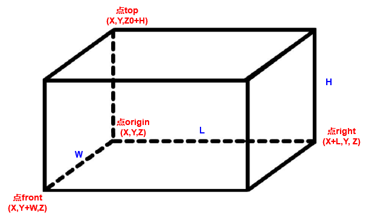
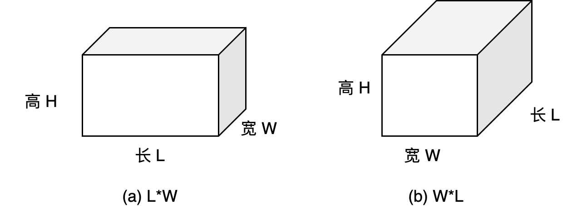
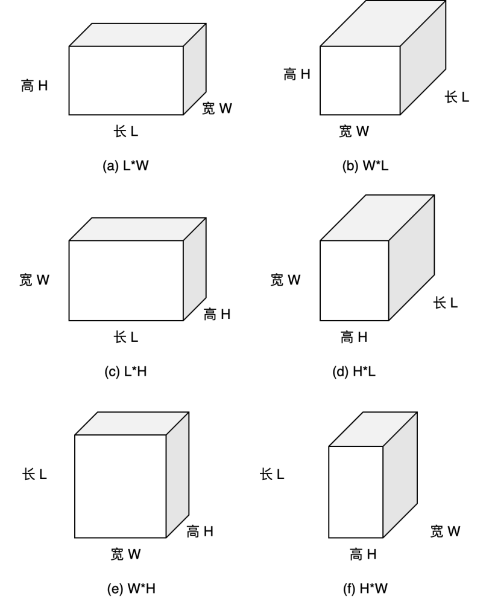
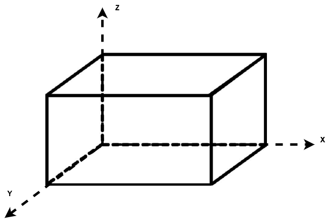
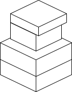
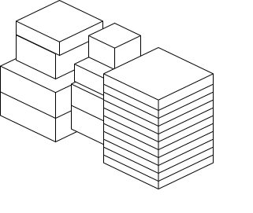
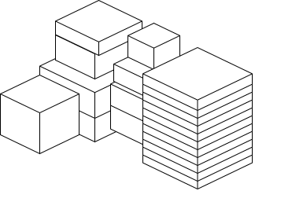
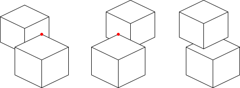
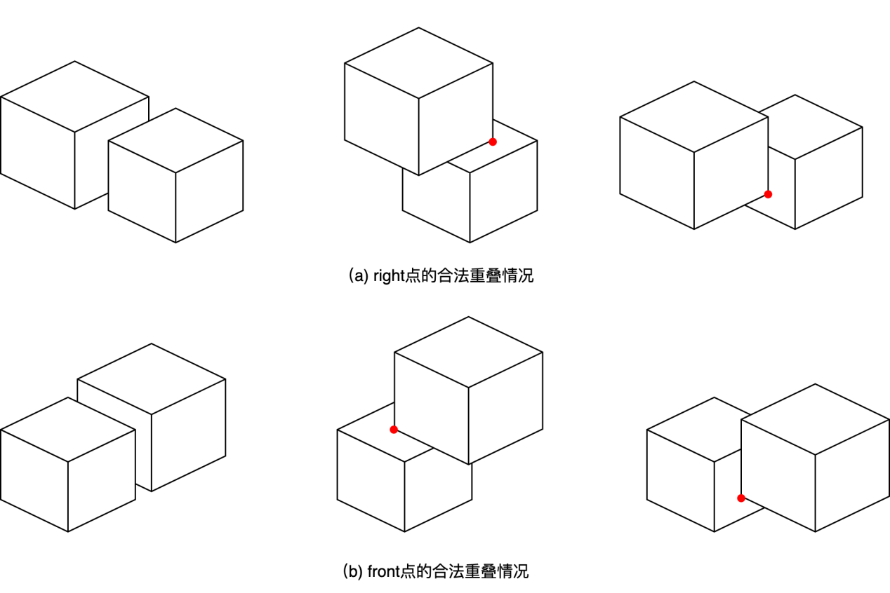
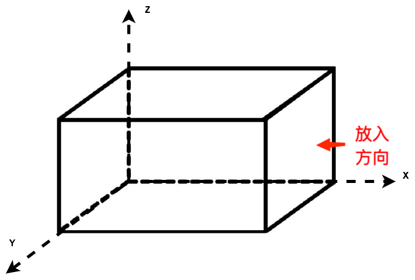

# 算法实践题-装箱问题

周日晚上班-第10组

2022202210124 陈  杰

2022202210121 易文哲

## 问题描述

物流公司在流通过程中，需要将打包完毕的箱子装入到一个货车的车厢中，为了提高物流效率，需要将车厢尽量填满，显然，车厢如果能被100%填满是最优的，但通常认为，车厢能够填满85%，可认为装箱是比较优化的。

设车厢为长方形，其长宽高分别为L，W，H；共有n个箱子，箱子也为长方形，第i个箱子的长宽高为li，wi，hi（n个箱子的体积总和是要远远大于车厢的体积），做以下假设和要求：

1. 长方形的车厢共有8个角，并设靠近驾驶室并位于下端的一个角的坐标为（0,0,0），车厢共6个面，其中长的4个面，以及靠近驾驶室的面是封闭的，只有一个面是开着的，用于工人搬运箱子；
2. 需要计算出每个箱子在车厢中的坐标，即每个箱子摆放后，其和车厢坐标为（0,0,0）的角相对应的角在车厢中的坐标，并计算车厢的填充率。

问题分解为基础和高级部分，完成基础部分可得78分以上，完成高级部分可得85分以上。

基础部分：

1. 所有的参数为整数；
2. 静态装箱，即从n个箱子中选取m个箱子，并实现m个箱子在车厢中的摆放（无需考虑装箱的顺序，即不需要考虑箱子从内向外，从下向上这种在车厢中的装箱顺序）；
3. 所有的箱子全部平放，即箱子的最大面朝下摆放；
4. 算法时间不做严格要求，只要1天内得出结果都可。

高级部分：

1. 参数考虑小数点后两位；
2. 实现在线算法，也就是箱子是按照随机顺序到达，先到达先摆放；
3. 需要考虑箱子的摆放顺序，即箱子是从内到外，从下向上的摆放顺序；
4. 因箱子共有3个不同的面，所有每个箱子有3种不同的摆放状态；
5. 算法需要实时得出结果，即算法时间小于等于2秒。

## 解题思路

### 空间表示与摆放状态

我们使用四个点来表示一个箱子的空间位置。其中点origin是箱子的原点，也是存储于放置列表中的点，其他三个点（top，right，front）将用于箱子重叠情况的判断和下一个箱子的原点可放置的位置。一个箱子用四个点，或者origin点和箱子长宽高（l、w、h）就可以确定其位置。

箱子的数据中默认长>宽>高，静态装箱问题最大面朝下摆放，因此L*W面朝下，则有两种摆放状态。

动态场景对箱子的摆放没有约束，因此不需要最大面朝下，共有六种摆放方式。

在静态算法中，由于可以事先得知所有箱子的种类和数量，因此我们首先对所有箱子按照体积大小排序，体积大的箱子优先摆放，体积小的箱子后摆放。而动态算法中箱子实时随机到来，如果允许并且有空间可以放入，则必须放入，当怎么调整都无法放入时，放弃该箱子，等待下一个箱子。

### 箱子堆叠方式与三个可放置点列表

我们将箱子的L长度方向作为X轴，宽度W方向作为Y轴，高度H方向作为Z轴。每当一个新的箱子放入，会产生三个新的可放入点（top，right，front），供下一个箱子放入。因此针对三个可放入点，分别设置三个可放置点列表：高度列表h_wait_loc，长度列表l_wait_loc，宽度列表w_wait_loc用于下一个箱子的放置，每个列表存放一个方向。
比如：当车厢为空时，只有一个放置点（0，0，0），放置第一个箱子（体积最大的那个），然后将该箱子的top、right、front点分别放入h_wait_loc，l_wait_loc，w_wait_loc列表中。

之后的箱子，静态算法按照先上（H），后右（L），再前（W）的顺序进行摆放，即：

① 先从第一个箱子的上方开始摆放，形成一个竖排，直至达到车厢顶部无法再往上堆叠；

② 然后向第一个箱子（确切的说，是第一竖排的箱子）右边开始摆放，并且同样按照①的步骤摆出第二个竖排，以此类推第三个竖排、第四个竖排……直至长度方向不能再摆放箱子（从几何角度看，就是在车子的这一边上摆出了箱子形成的“一堵墙”）；

③ 摆完“一堵墙面”后，再从这堵“箱子墙面”的前方，也是第一竖排箱子的前方开始摆放，同②步骤一样摆出第二堵“箱子墙”；

从代码角度来理解，每次摆完一个箱子后，都需要把这个箱子的其他三点top、right、front分别放入h_wait_loc，l_wait_loc，w_wait_loc列表中。而摆放顺序就是三个while循环。

以内部的遍历h_wait_loc列表为例，在最初第一个箱子摆放完之后，h_wait_loc会有第一个箱子的top点坐标，按照体积从大到小的顺序遍历所有箱子种类，看下一个箱子取出该h_wait_loc中的点并判断该坐标能否放置自身（默认摆放方式按照长棱延x轴，宽棱延y轴，另一种摆放方式与之相反），若可行，将自己的top点坐标放入h_wait_loc列表，同时将自身的right点、front点放入另外两个列表（如果摆放的箱子和其下面箱子是同一种型号，那么就不把其right点、front点放入）；若不能放置自身，则继续遍历其他种类箱子。如果所有箱子遍历完都不能再往上摆放，此时h_wait_loc是空列表，就会退出该层循环进入l_wait_loc列表的循环遍历。

### 箱子越界与合法性判断

箱子必须完全在卡车车厢内部，即箱子的四个点（origin、top、right、front）都必须在车厢坐标轴内。任何一个点超出都不能放入车厢中。

对于如上图的一个箱子，如果一个点（a,b,c）在该箱子(x,y,z)内部【包括箱子的六个表面】，那么必然会有以下判断条件

① a≥x, b≥y, c≥z

② a≤x+L（也就是箱子right点的x轴坐标），b≤y+W（也就是箱子front点y轴坐标），c≤z+H（箱子top点z轴坐标）

对于某个箱子来说，按照我们算法的摆放顺序，箱子的top、right、front点将有可能与其他箱子发生重叠，因此摆放一个箱子的时候，要判断该箱子的这三点是否合法：

对于top点来说：

该点能与其他箱子的以上三个面发生重合，而与这三个面重合算紧邻情况，是合法的，因此在基础的判断条件上，要去除掉可以发生重合的这三个面，其非法重叠判断如下：

① a≥x, b≥y, c＞z

② a＜x+L（也就是箱子right点的x轴坐标），b＜y+W（也就是箱子front点y轴坐标），c≤z+H（箱子top点z轴坐标）

对于right点和front点，同样可以与其他箱子有如下重叠情况。

right点的非法重叠判断：

① a＞x, b≥y, c≥z
② a≤x+L（也就是箱子right点的x轴坐标），b＜y+W（也就是箱子front点y轴坐标），c＜z+H（箱子top点z轴坐标）

front点的非法重叠判断：
① a≥x, b＞y, c≥z
② a＜x+L（也就是箱子right点的x轴坐标），b≤y+W（也就是箱子front点y轴坐标），c＜z+H（箱子top点z轴坐标）

动态算法中由于车厢可装填方向只有一面，因此在填充时采用先下后上、由内而外的顺序，即先填充z轴，再是y轴，最后是x轴。因此实际摆放时箱体墙由内而外填充。

## 数据集

卡车长宽高为 587,233,220；

数据集都存储为了csv的形式，data文件夹内包含了不同箱子种类的数据，记录了箱子种类、长宽高和数量。

其中E1-3种箱子，E2-5种箱子，E3-8种箱子，E4-10种箱子，E5-15种箱子。

以E1-1为例：

| 箱子名称 | 长   | 宽   | 高   | 数目  |
|:----:|:---:|:---:|:---:|:---:|
| box1 | 108 | 76  | 30  | 40  |
| box2 | 110 | 43  | 25  | 33  |
| box3 | 92  | 81  | 55  | 39  |

## 代码

3D_box_loader_static.py为静态装箱代码

3D_box_loader_active.py为动态装箱代码，其逻辑与静态相似
