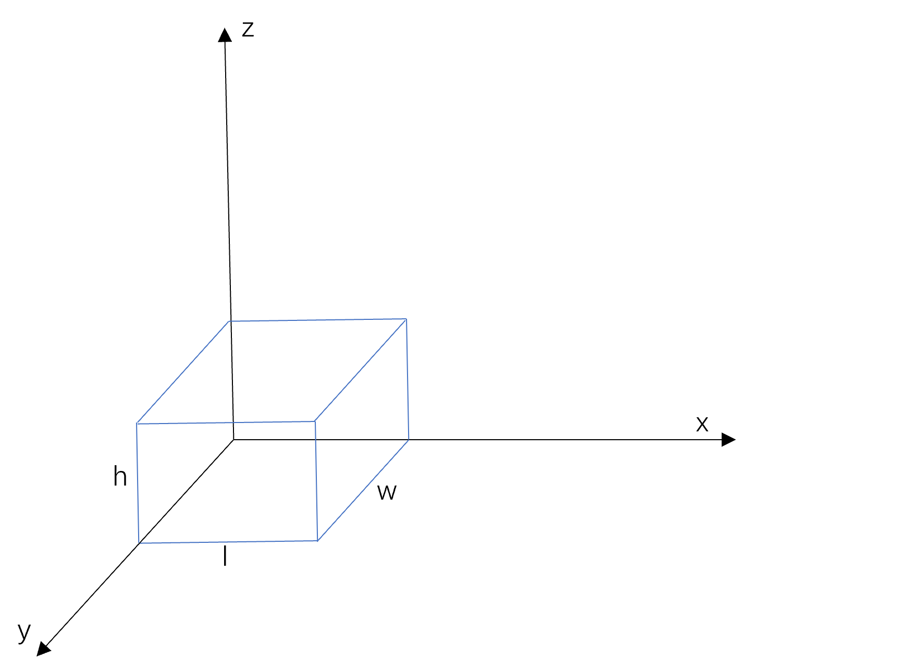

## 物流装箱问题

### 问题描述

物流公司在流通过程中，需要将打包完毕的箱子装入到一个货车的车厢中，为了提高物流效率，需要将车厢尽量填满，显然，车厢如果能被100%填满是最优的，但通常认为，车厢能够填满85%，可认为装箱是比较优化的。

设车厢为长方形，其长宽高分别为L，W，H；共有n个箱子，箱子也为长方形，第i个箱子的长宽高为li，wi，hi（n个箱子的体积总和是要远远大于车厢的体积），做以下假设和要求：

1. 长方形的车厢共有8个角，并设靠近驾驶室并位于下端的一个角的坐标为（0,0,0），车厢共6个面，其中长的4个面，以及靠近驾驶室的面是封闭的，只有一个面是开着的，用于工人搬运箱子；

2. 需要计算出每个箱子在车厢中的坐标，即每个箱子摆放后，其和车厢坐标为（0,0,0）的角相对应的角在车厢中的坐标，并计算车厢的填充率；

3. 每个箱子有长、宽、高三个不同的长度，因此有6种摆放方式。

### 问题分析

该问题可视作容器数量为1的三维装箱问题的特例。三维装箱问题的描述是：假设有n个物品，其长宽高分别为($l_1,w_1,h_1$),($l_2,w_2,h_2$)...($l_n,w_n,h_n$)，有m个容器，容器的容积为V，是否能用m个容器将物品全部装入。本题目的物流装箱问题是三维装箱问题的一种特殊情况，即容器数量为1，无法完全将所有物品装入车厢中，需要使车厢达到最高填充率。

装箱问题是一个复杂的离散组合最优化问题。组合优化问题存在大量的局部极值点，属于NP完全问题。即在多项式时间内能检验答案是否正确，但不存在一种算法能在多项式时间内解出确定性答案。针对此类问题，若采用深度优先搜索或是暴力搜索等算法，时间复杂度较高。当装入箱子数较大时，求得最优解的时间也会急剧增加。依据本题目所给出的数据集，单一车厢所需要装入的箱子数较大，采用搜索找出最优解的方式难以满足性能需求。

针对该题的要求，我们采用启发式算法进行装箱策略的优化。启发式算法可以在合理时间内得到一个不错的解。我们选择遗传算法进行装箱策略的优化。遗传算法是一种进化算法，其借鉴了进化生物学中的一些现象发展起来，包括遗传、突变、自然选择等。引入遗传算法来在较短时间内得到全局最优解。

#### 装箱策略

首先，题目所要求的目标是使得车厢的填充率尽可能高，假设车厢内能放入n个箱子，各箱子放入车厢的先后顺序不同，且一个包裹存在6种摆放姿势，因此共有$n!6^n$种可能性。

建立一个三维坐标系，分别为$x$轴、$y$轴、$z$轴，分别对应箱子$l$、$w$、$h$三条边。



当箱子放入时，可通过旋转的方式来调整方向，若物体的尺寸为(l,w,h)，则其6种坐标变换如下表所示。

| x轴  | y轴  | z轴  |
| :--: | :--: | :--: |
|  l   |  w   |  h   |
|  l   |  h   |  w   |
|  h   |  w   |  l   |
|  h   |  l   |  w   |
|  w   |  l   |  h   |
|  w   |  h   |  l   |

在放置时先考虑z轴，再考虑y轴，最后考虑x轴。z值越小则优先度越高，若z值相同，则比较y值，最后比较x值。

第一个箱子放置在原点位置，若无法放置则进行旋转操作。接下来第二个箱子放置时选择三条坐标轴的任意方向紧靠其放置，以达到最优的填充率，若无法放入则旋转箱子。对于第n个箱子，可以考虑放置在箱子(1...n-1)的x轴、y轴、z轴方向上。

在放入新箱子时，需要对其进行校验，若不满足如下条件：

1. 新加入箱子超出车厢的包含范围
2. 新箱子与原有箱子的位置出现重合

则需要通过旋转或是改变位置的方式 ，以完成新箱子的放入。若最终箱子无法放入车厢内，则认为已经完成箱子的填充操作。

##### 装箱策略的代码实现

```python
def init_box(l, w, h):
    return np.zeros((l, w, h), dtype=np.int)


def modify_space(box, pos, l, w, h):
    x, y, z = pos[0], pos[1], pos[2]
    box[x:x + l, y:y + w, z:z + h] = 1


def judge_item(box, pos, l, w, h):
    max_l, max_w, max_h = box.shape  # 箱子的参数
    x, y, z = pos[0], pos[1], pos[2]  # 当前摆放的位置

    if l + x > max_l or w + y > max_w or z + 1 > max_h:
        return False, 0

    for i in range(x, x + l):  # 如果放进去的快递超过了箱子的长和宽，则失败
        for j in range(y, y + w):
            if box[i, j, z]:
                return False, 0

    min_h = z
    for k in range(z - 1, -1, -1):  # 找到可以放进去的箱子的最大高度
        flag = True
        for i in range(x, x + l):
            for j in range(y, y + w):
                if box[i, j, k]:
                    flag = False
                    break
            if not flag:
                break
        if not flag:
            break
        min_h -= 1

    if min_h + h > max_h:
        return False, z - min_h

    for k in range(1, h - z + min_h):
        for i in range(x, x + l):
            for j in range(y, y + w):
                if box[i, j, z + k]:
                    return False, z - min_h

    return True, z - min_h

def pack_item_into_box(list_item, box_para, seq):  # 查看DNA（装柜顺序及姿势)的空间利用率和装柜结果
    max_l, max_w, max_h = box_para['dimensions']
    box = init_box(max_l, max_w, max_h)  # 将抽屉划分为小空间
    pos_list = [[0, 0, 0]]  # 可选放置点
    info = []

    total_space = max_w * max_l * max_h
    used_space = 0

    dir_list = [(0, 1, 2), (0, 2, 1), (1, 0, 2), (1, 2, 0), (2, 0, 1), (2, 1, 0)]
    for i in range(len(list_item)):
        pos_list.sort(key=lambda x: (x[2], x[1], x[0]))  # 放置点列表更新后，为保证约定的放置顺序，排序放置点
        item = list_item[seq[i][0]]
        seq_dir = seq[i][1]
        l, w, h = item['size'][dir_list[seq_dir][0]], item['size'][dir_list[seq_dir][1]], item['size'][
            dir_list[seq_dir][2]]
        if l > max_l or w > max_w or h > max_h or (used_space + l * w * h) > total_space:
            continue
        for index, pos in enumerate(pos_list):
            flag, min_h = judge_item(box, pos, l, w, h)  # 依次实验在每个放置点放置包裹，如果包裹在这个位置能放成功，装入抽屉
            if flag:
                new_pos = [pos[0], pos[1], pos[2] - min_h]
                modify_space(box, new_pos, l, w, h)
                info.append("{}-shape({}, {}, {})-location:{}".format(item['id'], l, w, h, new_pos))
                pos_list.pop(index)

                pos_list.append([new_pos[0] + l, new_pos[1], new_pos[2]])
                pos_list.append([new_pos[0], new_pos[1] + w, new_pos[2]])
                pos_list.append([new_pos[0], new_pos[1], new_pos[2] + h])

                used_space += l * w * h
                break

    space_ratio = used_space / total_space

    return space_ratio, info
```

#### 装箱优化

上述装箱策略描述的是未进行装箱优化的情况下，基于固定顺序的箱子输入时的装填策略。但依据该策略所达到的情况未必是全局最优或是全局次优解，可能仅为局部最优解，因此我们采用遗传算法的方式对策略进行优化，以求找到全局最优解。

染色体长度为n，其在代码中由一个二元组数组list_item表示，list_item由seq_id和seq_dir构成，list_id存放各个箱子的编号，list_dir存放箱子所摆放的姿势。

遗传算法包括了初始化种群、交叉运算、变异运算、选择运算等部分。

在初始化种群上，生成与种群规模相同的种群，随机放入箱子编号和箱子的摆放姿势。

在变异运算上，本代码主要由两个算法构成，一个算法负责随机交换两个箱子装入车厢的顺序；另一个算法负责随机交换箱子的装车姿势。这个过程模拟了遗传物质在随机点位上出现变异现象，其变异的过程是等概率的。

在交叉运算上，其过程模仿DNA复制的过程，子代会继承父染色体和母染色体的遗传信息。在本题目中，子代染色体会继承父染色体的装箱姿势和母染色体的装箱顺序。

在选择运算上，本代码采用有放回抽样，比较抽出样本的填充率，将填充率高的样本放入新种群。每轮迭代后形成一轮新种群。

在参数设置上，种群规模为20，交叉概率为0.7，变异概率为0.05，最大迭代轮数为50。

##### 装箱优化代码实现

```python
def exchange_item(list_item):  # 随机交换两个箱子装车顺序
    count = len(list_item)
    if count > 1:
        s1, s2 = random.randint(0, count - 1), random.randint(0, count - 1)
        while s1 == s2:
            s2 = random.randint(0, count - 1)
        list_item[s1], list_item[s2] = list_item[s2], list_item[s1]


def exchange_direction(list_item):  # 随机交换某个箱子的装车姿势
    count = len(list_item)
    s = random.randint(0, count - 1)
    new_dir = random.randint(0, 5)
    while new_dir == list_item[s][1]:
        new_dir = random.randint(0, 5)
    list_item[s] = (list_item[s][0], new_dir)


def crossover(list_item_a, list_item_b):  # 交叉配对（父亲，母亲）
    count = len(list_item_a)
    # 后代继承了母亲的装箱子顺序和父亲的装箱子姿势
    list_item_c = copy.deepcopy(list_item_a)
    c_pos = random.randint(1, count - 1)
    slice_a, slice_b = list_item_a[c_pos:], list_item_b[c_pos:]
    slice_a_id, slice_b_id = [i[0] for i in slice_a], [j[0] for j in slice_b]
    list_item_c[c_pos:] = list_item_b[c_pos:]
    for i in range(c_pos):
        c_id = list_item_c[i][0]
        if c_id in slice_b_id:
            while c_id in slice_b_id:
                c_id = slice_a_id[slice_b_id.index(c_id)]
            list_item_c[i] = slice_a[slice_a_id.index(c_id)]

    return list_item_c


def init_ethnic(list_item, ethnic_num):  # 初始化族群，个数为ethnic_num
    count = len(list_item)
    ethnic_list = []
    seq_id = list(range(count))
    for i in range(ethnic_num):
        random.shuffle(seq_id)
        seq_dir = [random.randint(0, 5) for j in range(count)]
        ethnic_list.append([(seq_id[j], seq_dir[j]) for j in range(count)])
    return ethnic_list


def ethnic_reproduction(list_item, box, ethic_num, p_cross, p_mut, max_iteration):

    # 初始化族群
    ethic_list = init_ethnic(list_item, ethic_num)
    space_ratio_list, info_list = [], []
    for i in range(ethic_num):
        space_ratio, info = pack_item_into_box(list_item, box, ethic_list[i])
        space_ratio_list.append(space_ratio)
        info_list.append(info)
    space_ratio_best = max(space_ratio_list)
    info_best = info_list[space_ratio_list.index(space_ratio_best)]
    # print((space_ratio_best, info))
    # print('\n')

    for i in tqdm(range(max_iteration)):
        for j in range(ethic_num):
            if random.random() <= p_cross:
                new_list_item = crossover(ethic_list[j], ethic_list[(j + 1) % ethic_num])
                if random.random() <= p_mut:
                    if random.random() > 0.5:
                        exchange_item(new_list_item)
                    else:
                        exchange_direction(new_list_item)
                ethic_list.append(new_list_item)
                space_ratio, info = pack_item_into_box(list_item, box, new_list_item)
                space_ratio_list.append(space_ratio)
                info_list.append(info)

        space_ratio_best_cur = max(space_ratio_list)
        if space_ratio_best_cur > space_ratio_best:
            space_ratio_best = space_ratio_best_cur
            info_best = list_item[space_ratio_list.index(space_ratio_best)]
        # print((space_ratio_best, info))

        select_id = []
        for j in range(ethic_num):
            select_one_round = np.random.choice(list(range(len(space_ratio_list))), 2, replace=False)
            if space_ratio_list[select_one_round[0]] >= space_ratio_list[select_one_round[1]]:
                select_id.append(select_one_round[0])
            else:
                select_id.append(select_one_round[1])
        space_ratio_list = [space_ratio_list[k] for k in select_id]
        info_list = [info_list[k] for k in select_id]
        ethic_list = [ethic_list[k] for k in select_id]

    return space_ratio_best, info_best
```

### 实验结果

由于题目所涉及的数据集组数较多，其结果较多，由于实验报告篇幅所限，此处仅展示不同组箱子的情况下填充率的情况。其余装箱的具体情况在提交文件中。

|        | 3种箱子 | 5种箱子 | 8种箱子 | 10种箱子 | 15种箱子 |
| :----: | :-----: | :-----: | :-----: | :------: | :------: |
| 第一组 | 0.7390  | 0.7581  | 0.7423  |  0.7352  |  0.7118  |
| 第二组 | 0.7245  | 0.7576  | 0.7338  |  0.7434  |  0.7360  |
| 第三组 | 0.7196  | 0.7496  | 0.7403  |  0.7266  |  0.7231  |
| 第四组 | 0.7677  | 0.7312  | 0.7358  |  0.7226  |  0.7176  |
| 第五组 | 0.7720  | 0.7313  | 0.7286  |  0.7412  |  0.7545  |

可以看到，各组数据的填充率均在75%左右，箱子的装填效果较好，下面以E1-5为例。

经过50轮迭代后，得到的运行结果如下：

```python
(0.7719866186412457, 
 ['1-(78, 27, 37)-location:[0, 0, 0]', 
  '1-shape(37, 78, 27)-location:[78, 0, 0]', 
  '2-shape(70, 89, 25)-location:[115, 0, 0]', 
  '1-shape(37, 78, 27)-location:[185, 0, 0]', 
  '1-shape(78, 27, 37)-location:[222, 0, 0]', 
  '3-shape(84, 90, 41)-location:[300, 0, 0]', 
  '3-shape(41, 90, 84)-location:[384, 0, 0]', 
  '3-shape(84, 90, 41)-location:[425, 0, 0]', 
  '2-shape(89, 70, 25)-location:[185, 78, 0]', 
  '2-shape(89, 70, 25)-location:[300, 90, 0]', 
  '1-shape(78, 27, 37)-location:[509, 0, 0]', 
  '3-shape(90, 41, 84)-location:[389, 90, 0]', 
  '2-shape(89, 70, 25)-location:[479, 90, 0]', 
  '2-shape(70, 89, 25)-location:[0, 27, 0]', 
  '2-shape(25, 70, 89)-location:[78, 78, 0]', 
  '2-shape(70, 89, 25)-location:[115, 89, 0]', 
  '3-shape(84, 90, 41)-location:[389, 131, 0]', 
  '3-shape(90, 84, 41)-location:[185, 148, 0]', 
  '2-shape(70, 89, 25)-location:[0, 116, 0]', 
  '2-shape(70, 89, 25)-location:[115, 0, 25]', 
  '1-shape(27, 37, 78)-location:[222, 27, 0]', 
  '1-shape(37, 78, 27)-location:[78, 148, 0]', 
  '1-shape(78, 27, 37)-location:[509, 27, 0]', 
  '2-shape(70, 89, 25)-location:[0, 27, 25]', 
  '1-shape(27, 78, 37)-location:[115, 89, 25]', 
  '3-shape(41, 90, 84)-location:[142, 89, 25]', 
  '1-shape(37, 78, 27)-location:[300, 90, 25]', 
  '1-shape(78, 27, 37)-location:[509, 54, 0]', 
  '1-shape(78, 27, 37)-location:[479, 160, 0]', 
  '2-shape(89, 25, 70)-location:[479, 187, 0]', 
  '1-shape(37, 78, 27)-location:[337, 90, 25]', 
  '3-shape(90, 41, 84)-location:[185, 78, 25]', 
  '1-shape(37, 27, 78)-location:[249, 27, 0]', 
  '3-shape(84, 41, 90)-location:[479, 90, 25]', 
  '2-shape(89, 25, 70)-location:[185, 119, 25]', 
  '1-shape(78, 37, 27)-location:[0, 116, 25]', 
  '2-shape(70, 25, 89)-location:[0, 205, 0]', 
  '3-shape(41, 84, 90)-location:[509, 0, 37]', 
  '1-shape(27, 37, 78)-location:[115, 178, 0]', 
  '1-shape(27, 78, 37)-location:[78, 0, 27]', 
  '3-shape(90, 84, 41)-location:[389, 131, 41]', 
  '3-shape(90, 41, 84)-location:[479, 131, 37]', 
  '3-shape(90, 84, 41)-location:[185, 148, 41]', 
  '3-shape(41, 90, 84)-location:[300, 0, 41]', 
  '3-shape(90, 41, 84)-location:[115, 0, 50]', 
  '3-shape(41, 84, 90)-location:[341, 0, 41]', 
  '3-shape(90, 41, 84)-location:[479, 187, 70]', 
  '2-shape(25, 70, 89)-location:[275, 148, 0]', 
  '2-shape(70, 25, 89)-location:[0, 153, 25]', 
  '3-shape(41, 84, 90)-location:[425, 0, 41]', 
  '3-shape(41, 84, 90)-location:[466, 0, 41]', 
  '3-shape(90, 84, 41)-location:[389, 131, 82]', 
  '3-shape(90, 41, 84)-location:[185, 148, 82]', 
  '2-shape(25, 89, 70)-location:[550, 0, 37]', 
  '2-shape(89, 70, 25)-location:[300, 160, 0]', 
  '1-shape(37, 27, 78)-location:[300, 168, 25]', 
  '1-shape(37, 78, 27)-location:[78, 148, 27]', 
  '2-shape(25, 89, 70)-location:[0, 27, 50]', 
  '2-shape(70, 25, 89)-location:[0, 178, 25]', 
  '1-shape(27, 37, 78)-location:[337, 168, 25]', 
  '3-shape(41, 90, 84)-location:[384, 0, 84]', 
  '2-shape(25, 89, 70)-location:[25, 27, 50]', 
  '1-shape(37, 78, 27)-location:[300, 90, 52]', 
  '3-shape(84, 90, 41)-location:[0, 27, 120]', 
  '3-shape(84, 90, 41)-location:[0, 117, 114]', 
  '1-shape(37, 27, 78)-location:[142, 179, 0]', 
  '2-shape(70, 89, 25)-location:[84, 117, 109]', 
  '3-shape(90, 84, 41)-location:[389, 131, 123]', 
  '1-shape(37, 27, 78)-location:[142, 206, 0]', 
  '3-shape(41, 84, 90)-location:[300, 0, 125]', 
  '3-shape(90, 41, 84)-location:[185, 189, 82]', 
  '2-shape(25, 70, 89)-location:[275, 78, 0]', 
  '1-shape(37, 27, 78)-location:[300, 195, 25]', 
  '1-shape(27, 37, 78)-location:[115, 41, 50]', 
  '2-shape(70, 25, 89)-location:[0, 0, 37]', 
  '3-shape(84, 41, 90)-location:[300, 90, 79]', 
  '1-shape(78, 27, 37)-location:[222, 0, 37]', 
  '1-shape(78, 37, 27)-location:[142, 41, 50]', 
  '1-shape(27, 78, 37)-location:[50, 27, 50]', 
  '1-shape(37, 78, 27)-location:[337, 90, 52]', 
  '3-shape(41, 84, 90)-location:[509, 0, 127]', 
  '3-shape(84, 90, 41)-location:[425, 0, 131]', 
  '3-shape(90, 41, 84)-location:[384, 90, 84]', 
  '2-shape(25, 89, 70)-location:[275, 78, 89]', 
  '1-shape(78, 37, 27)-location:[0, 116, 52]', 
  '3-shape(84, 90, 41)-location:[115, 0, 134]', 
  '1-shape(37, 27, 78)-location:[337, 205, 25]', 
  '3-shape(41, 90, 84)-location:[509, 84, 121]', 
  '2-shape(70, 25, 89)-location:[222, 0, 74]', 
  '1-shape(37, 27, 78)-location:[78, 0, 64]', 
  '1-shape(37, 78, 27)-location:[78, 148, 54]', 
  '1-shape(37, 27, 78)-location:[222, 27, 78]', 
  '1-shape(37, 78, 27)-location:[78, 148, 81]', 
  '1-shape(37, 27, 78)-location:[259, 27, 78]', 
  '1-shape(27, 78, 37)-location:[115, 89, 62]', 
  '2-shape(70, 89, 25)-location:[115, 90, 134]', 
  '2-shape(70, 25, 89)-location:[300, 131, 79]', 
  '2-shape(89, 25, 70)-location:[185, 119, 95]', 
  '2-shape(70, 25, 89)-location:[300, 168, 103]',
  '1-shape(37, 78, 27)-location:[550, 0, 107]', 
  '2-shape(25, 89, 70)-location:[84, 27, 89]', 
  '2-shape(25, 70, 89)-location:[550, 84, 121]', 
  '2-shape(25, 70, 89)-location:[341, 0, 131]', 
  '1-shape(78, 27, 37)-location:[142, 41, 77]', 
  '3-shape(84, 90, 41)-location:[0, 117, 155]', 
  '1-shape(37, 78, 27)-location:[550, 0, 134]', 
  '2-shape(25, 89, 70)-location:[84, 117, 134]', 
  '1-shape(78, 37, 27)-location:[0, 116, 79]', 
  '1-shape(27, 37, 78)-location:[300, 193, 103]',
  '2-shape(89, 70, 25)-location:[0, 27, 161]', 
  '3-shape(84, 90, 41)-location:[389, 131, 164]', 
  '2-shape(89, 70, 25)-location:[185, 148, 166]',
  '2-shape(89, 25, 70)-location:[84, 206, 108]', 
  '3-shape(84, 90, 41)-location:[425, 0, 172]', 
  '2-shape(89, 25, 70)-location:[185, 90, 109]', 
  '1-shape(78, 27, 37)-location:[0, 0, 126]', 
  '1-shape(78, 37, 27)-location:[479, 187, 154]', 
  '2-shape(70, 25, 89)-location:[0, 207, 89]', 
  '2-shape(89, 70, 25)-location:[300, 90, 169]', 
  '1-shape(37, 27, 78)-location:[327, 193, 103]', 
  '3-shape(90, 84, 41)-location:[115, 0, 175]', 
  '1-shape(37, 27, 78)-location:[550, 154, 121]', 
  '2-shape(70, 89, 25)-location:[115, 90, 159]', 
  '3-shape(90, 84, 41)-location:[205, 0, 163]', 
  '1-shape(27, 37, 78)-location:[479, 90, 115]', 
  '2-shape(70, 89, 25)-location:[115, 90, 184]', 
  '1-shape(37, 78, 27)-location:[550, 0, 161]', 
  '1-shape(27, 37, 78)-location:[479, 131, 121]',
  '1-shape(78, 27, 37)-location:[0, 0, 163]', 
  '2-shape(70, 89, 25)-location:[0, 27, 186]', 
  '1-shape(37, 27, 78)-location:[115, 179, 134]',
  '1-shape(27, 78, 37)-location:[384, 0, 168]',
  '1-shape(37, 27, 78)-location:[78, 0, 142]', 
  '1-shape(78, 27, 37)-location:[185, 119, 165]',
  '2-shape(89, 70, 25)-location:[185, 148, 191]', 
  '2-shape(89, 70, 25)-location:[300, 90, 194]', 
  '1-shape(78, 37, 27)-location:[389, 90, 168]', 
  '2-shape(89, 70, 25)-location:[300, 160, 192]', 
  '1-shape(37, 78, 27)-location:[70, 27, 186]', 
  '1-shape(78, 37, 27)-location:[479, 187, 181]'])
```

以'1-shape(78, 37, 27)-location:[479, 187, 181]'为例，’1‘表示箱子的类型，’shape(78, 37, 27)‘表示箱子的形状，’location:[479, 187, 181]‘表示箱子的位置。
