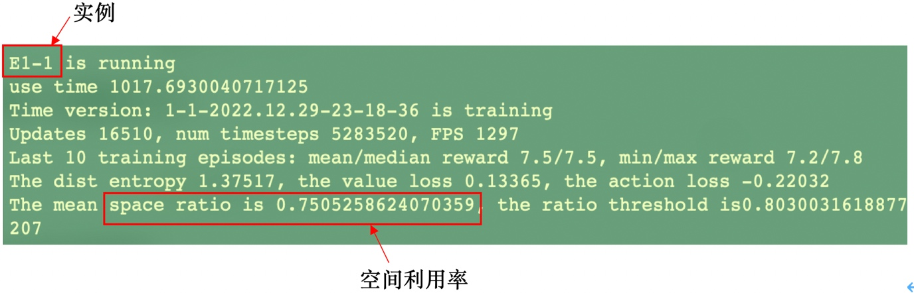
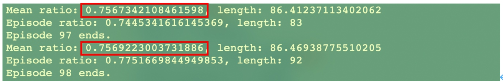
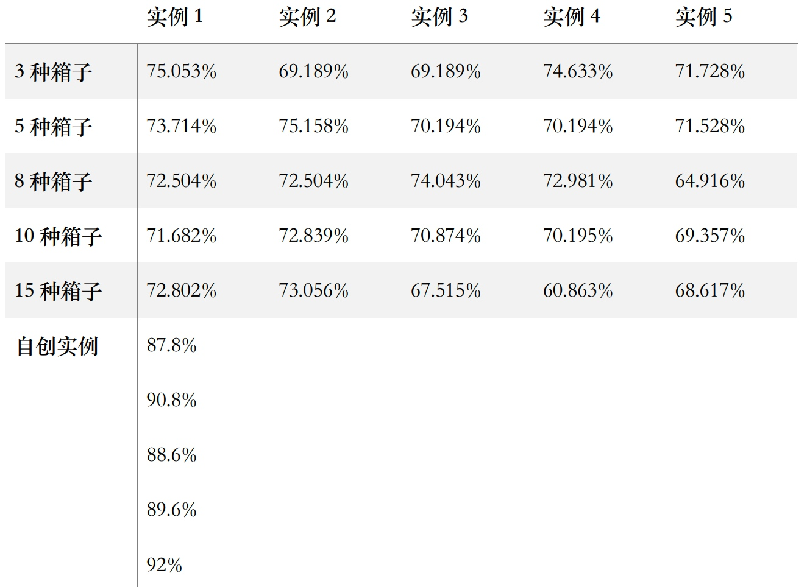
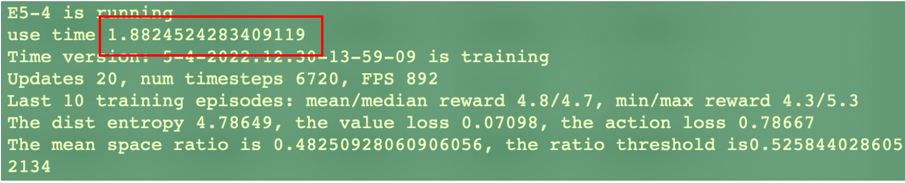

已完成任务中全部高级部分要求。

## Dependencies
* gym==0.13.0
* Python == 3.7
* torch == 1.10.0+cu111
* Ubuntu 20

## 算法思路概要
用包装配置树PCT描述装箱状态和动作空间 ——> 图注意网络编码提取状态特征 ——> 利用深度强化学习的参与者网络和评论家网络训练模型 ——> 输出动作(最终放置位置)

## 说明
首先程序在tool.py中定义了PCT的所有参数，之后模型的构建及训练、算法的评估、与其他3D-BPP解决方法的对照等都是在此定义的基础上进行。除去共享的tool.py外，整个代码总体分为三个部分： 
1. 训练程序，该部分为核心部分，其主体由main.py、kfac.py、model.py、attention_model.py、givendata.py构成；在这里代码完成了实验环境的搭建、实验数据的定义以及模型的训练。
2. 评估程序，主要由evaluation.py、evaluation_tools.py构成；在这里代码模拟了一个训练时的环境，并调用已经训练完成的模型对其进行评估。
3. 对照实验（启发式算法），对应heuristic.py；在这里集成了用于作为baseline的方法，以体现本方法的优势。

在主程序main.py中，首先
```
    #输入实验名称，如1-1，实验结果数据以此名称保存到'.\logs\experiment' and '.\logs\runs'
    custom = input('Please input the experiment name\n')
    timeStr = custom + '-' + time.strftime('%Y.%m.%d-%H-%M-%S', time.localtime(time.time()))
```
然后进行一系列环境及训练配置的设定（这里不做展示，详见代码），随后开展模型的训练流程：
```
    # 创建PCT的 actor & critic 网络
    PCT_policy =  DRL_GAT(args)
    PCT_policy =  PCT_policy.to(device)

    # 如果需要加载已训练模型
    if args.load_model:
        PCT_policy = load_policy(args.model_path, PCT_policy)
        print('Loading pre-train model', args.model_path)

    # 训练模型
    trainTool = train_tools(writer, timeStr, PCT_policy, args, custom)
    trainTool.train_n_steps(envs, args, device)
```

在train_tools.py中进行模型的训练，评估模型则在evaluation.py中。
数据的修改和添加等操作在givenData.py中，选择当前需要使用的数据即可：
```
container_size = [587,233,220]
item_size_set = []

#1-1
item = [[108,76,30,40],[110,43,25,33],[92,81,55,39]]
# #1-2
# item = [[91,54,45,32],[105,77,72,24],[79,78,48,30]]
......
# #5-5
# item = [[113,92,33,8],[52,37,28,12],[57,33,29,5],[99,37,30,12],[92,64,33,9],[119,59,39,12],[54,52,49,8],[75,45,35,6],[79,68,44,12],[116,49,47,9],[83,44,23,11],[98,96,56,10],[78,72,57,8],[98,88,47,9],[41,33,31,13]]

# 加载所有货物数据
for i in range(len(item)):
    for j in range(item[i][3]):
        item_size_set.append((item[i][0],item[i][1],item[i][2]))
```

货物的6种摆放方向在space.py中实现：
```
for rot in range(orientation):  
# 0 x y z, 1 y x z, 2 x z y,  3 y z x, 4 z x y, 5 z y x
    if rot == 0:
        sizex, sizey, sizez = next_box[0], next_box[1], next_box[2]
    elif rot == 1:
        sizex, sizey, sizez = next_box[1], next_box[0], next_box[2]
        if sizex == sizey:
            continue
    elif rot == 2:
        sizex, sizey, sizez = next_box[0], next_box[2], next_box[1]
        if sizex == sizey and sizey == sizez:
            continue
    elif rot == 3:
        sizex, sizey, sizez = next_box[1], next_box[2], next_box[0]
        if sizex == sizey and sizey == sizez:
            continue
    elif rot == 4:
        sizex, sizey, sizez = next_box[2], next_box[0], next_box[1]
        if sizex == sizey:
            continue
    elif rot == 5:
        sizex, sizey, sizez = next_box[2], next_box[1], next_box[0]
        if sizex == sizey:
            continue
```

## 运行
首先在givenData.py中设置好数据，使用以下命令进行训练：
```
python main.py --setting 2 --internal-node-holder 180 --leaf-node-holder 120 --device 1
```
setting选择2是符合任务要求的6种摆放方式的设定；两个以holder结尾的参数可以自行调整，目前这种设置比较适宜，太小会导致运行错误；device选择可用gpu id。

在训练中，模型会迭代输出每一步的空间利用率，输出的updates大概在10000左右会得到比较理想的结果。

如果需要评估模型则使用以下命令：
```
python evaluation.py --evaluate --load-model --model-path logs/experiment/2-2-2022.12.30-18-27-03/PCT-2-2-2022.12.30-18-27-03_2022.12.30-18-27-06.pt --internal-node-holder 180 --leaf-node-holder 120
```
其中‘2-2’表示实验号，根据需要修改路径名称。

评估自创数据的结果可使用以下命令：
```
python evaluation.py --evaluate --load-model --model-path pretrained/setting2_discrete.pt --load-dataset --dataset-path dataset/setting123_discrete.pt
```

需要帮助可使用以下命令：
```
python main.py -h
python evaluation.py -h
python heuristic.py -h
```

## 结果示例
训练结果：

对应评估结果：


实验结果数据：


运行时间：



## 参考
paper [Learning Efficient Online 3D Bin Packing on Packing Configuration Trees](https://openreview.net/forum?id=bfuGjlCwAq) 
